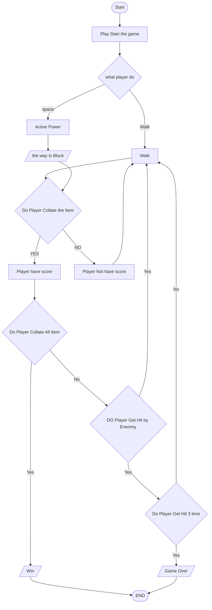
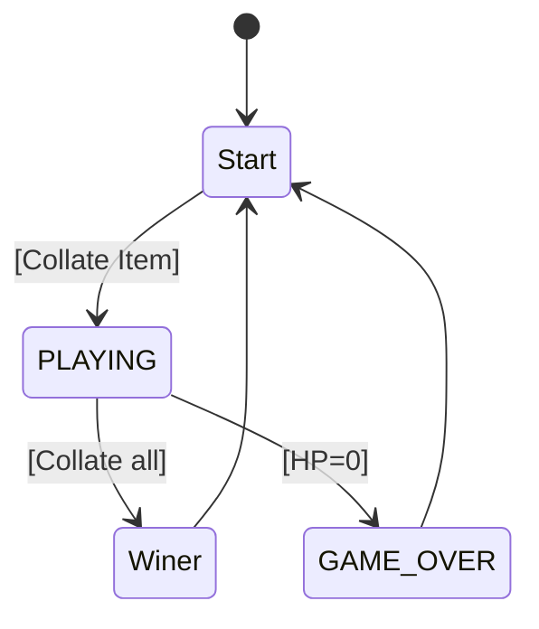

# 📝 [ชื่อโปรเจกต์ของกลุ่ม]

> **วิธีใช้ไฟล์นี้:** เขียนไฟล์นี้ **ก่อน** ลงมือเขียนโค้ด (spec-first) แล้วอัปเดตให้ตรงกับงานจริงก่อนส่ง
> ลบข้อความในวงเล็บเหลี่ยม `[ ... ]` และตัวอย่างที่เป็นตัวเอียงออก แล้วเขียนของกลุ่มเองแทน
> หัวข้อในไฟล์นี้เรียงตามเกณฑ์การให้คะแนน — ใช้เป็นโครงของสไลด์นำเสนอได้เลย

## 👥 ข้อมูลกลุ่ม

| รายการ                                           | รายละเอียด                                   |
| ------------------------------------------------------ | ------------------------------------------------------ |
| ชื่อโปรเจกต์                               | Italy Man                                              |
| Track                                                  | ☐ Terminal (`conio.h`) ✅ Raylib                   |
| Theme                                                  | ☐ Application/Game in Daily Life ✅ Game Application |
| ระดับความซับซ้อนที่ตั้งเป้า | ☐ พื้นฐาน ✅ กลาง ☐ สูง               |

| รหัสนักศึกษา | ชื่อ-สกุล                | หน้าที่หลัก (Coding / Presentation) |
| ------------------------ | -------------------------------- | ---------------------------------------------- |
| 692110128                | นาย จิรสิน แซ่ลี้ | Design / Art / Prfesentation                   |
| 692110145                | นาย ธนากร สุขโท้   | Coding / Presentation                          |
| [ ... ]                  | [ ... ]                          | [ ... ]                                        |

## 💡 แนวคิด (ความคิดสร้างสรรค์)

**ไอเดียหลัก (2–3 ประโยค):**
Italy Man ไล่เก็บวัดถุดิบอาหารเพื่อนำมาทำอาหารให้สมบูรณ์แบบโดยจะมีมอนเตอร์ที่เป็นอาหารเน่าเสียมาคอยก่อกวนผู้เล่นในการเก็บวัตถุดิบ

**ต่างจาก template / ตัวอย่างอย่างไร:**
[ *ระบุสิ่งที่กลุ่มคิดเพิ่มเอง ไม่ใช่แค่เปลี่ยนตัวอักษรหรือสี* ]

**Feature ของกลุ่ม:**

| # | Feature                                                                  | สถานะ |
| :-: | ------------------------------------------------------------------------ | :--------: |
| 1 | มอนเตอร์เดินในแผนที่คอยก่อกวนผู้เล่น |     ☐     |
| 2 | เมื่อผู้เล่นโดนมอนเตอร์จะเสียหัวใจ     |     ☐     |
| 3 | การสุ่มเกิดวัตถุดิบ                                   |     ☐     |
| 4 | ปล่อย object มาขัดขวางการเดินมอนเตอร์       |     ☐     |
| 5 | การเปลี่ยนด่าน                                             |     ☐     |
| 6 | หน้า menu                                                            |     ☐     |

## 🎮 วิธีใช้งาน / วิธีเล่น

| ปุ่ม / Input | การทำงาน   |
| ---------------- | ------------------ |
| w                | เดินหน้า   |
| a                | เดินซ้าย   |
| s                | เดินหลัง   |
| d                | เดินขวา     |
| r                | เริ่มใหม่ |
| space            | ปล่อยพลัง |
| esc              | เปิด UI        |

**กติกา / เงื่อนไขชนะ-แพ้:**

- ผู้เล่นจะต้องเก็บวัดถุดิให้ครบทามที่กำหนด (เงื่อนไขชนะ)
- ผู้ต้องถูกโจมตี 3 ครังถึงจะแพ้ (เงื่อนไขแพ้)

## 🔁 Flow การทำงาน (Flowchart)

> แก้ไข diagram ด้านล่างให้ตรงกับงานของกลุ่ม (เขียนด้วย Mermaid — ดูผลได้ใน VS Code / GitHub) หรือวาดด้วยเครื่องมืออื่นแล้วแนบรูป

**State ของโปรแกรม:**

## 🧩 การประยุกต์ใช้เนื้อหาที่เรียน

> ไม่ต้องอธิบายทุกบรรทัด — เลือก **1–3 จุดเด่น** ที่เป็นแกนของไอเดียมาอธิบายตอนนำเสนอ ส่วนที่เหลือใส่ในตารางและ comment ในโค้ด

| หัวข้อ                                        | ใช้ที่ไหนในโค้ด (ชื่อฟังก์ชัน / ตัวแปร) | ทำไมถึงเลือกใช้ |
| --------------------------------------------------- | ------------------------------------------------------------------------ | ------------------------------ |
| Variable (W3)                                       | [ ... ]                                                                  | [ ... ]                        |
| Operation — Arithmetic / Relational / Logical (W4) | [ ... ]                                                                  | [ ... ]                        |
| Control — Selection (W5)                           | [ ... ]                                                                  | [ ... ]                        |
| Control — Repetition (W6)                          | [ ... ]                                                                  | [ ... ]                        |
| Function (W8)                                       | [ ... ]                                                                  | [ ... ]                        |
| Array (W9)                                          | [ ... ]                                                                  | [ ... ]                        |
| Pointer (W10)                                       | [ ... ]                                                                  | [ ... ]                        |
| *(เพิ่มเติม)* Struct / File I/O (W11)    | [ ... ]                                                                  | [ ... ]                        |

**จุดเด่นที่จะนำเสนอ:**

1. [ ... ]
2. [ ... ]

## 🧪 ทดสอบ (Demo 3–4 กรณี)

> ต้องมีอย่างน้อย 1 กรณีที่ผู้ใช้กรอก/กดผิด แล้วโปรแกรมรับมือได้ (ไม่ค้าง ไม่ปิดเอง)

| # | Input / สิ่งที่ทำ                                                  | ผลที่คาดหวัง                                             | ผลจริง | ผ่าน? |
| :-: | --------------------------------------------------------------------------- | -------------------------------------------------------------------- | ------------ | :-------: |
| 1 | [*กด 1 ที่หน้า Title* ]                                          | [*เริ่มเกมระดับง่าย* ]                            | [ ... ]      |    ☐    |
| 2 | [ ... ]                                                                     | [ ... ]                                                              | [ ... ]      |    ☐    |
| 3 | [ ... ]                                                                     | [ ... ]                                                              | [ ... ]      |    ☐    |
| 4 | [*กด 9 หรือตัวอักษรที่หน้า Title (ผิดปกติ)* ] | [*ขึ้นข้อความเตือน ยังอยู่หน้า Title* ] | [ ... ]      |    ☐    |

## 🤖 การใช้ AI

| รายการ                                              | รายละเอียด                                                               |
| --------------------------------------------------------- | ---------------------------------------------------------------------------------- |
| ระดับ AIAS ที่ใช้                              | ☐ 2: AI Planning ☐ 3: AI Collaboration ☐ 5: AI Exploration (feature เสริม) |
| เครื่องมือ                                      | [*เช่น ChatGPT, Claude, Copilot* ]                                           |
| ใช้ช่วยทำอะไร                                | [ ... ]                                                                            |
| ส่วนที่กลุ่มเขียน/ตัดสินใจเอง | [ ... ]                                                                            |

## ✅ Checklist ก่อนส่ง

- [ ] Compile ผ่านโดยไม่มี warning (`-Wall`)
- [ ] ลองเล่น/ใช้งานครบทุก state และทุกกรณีทดสอบในตารางด้านบน
- [ ] Comment อธิบายส่วนสำคัญในโค้ด (ส่วนที่ไม่ได้อธิบายตอนนำเสนอ)
- [ ] ไฟล์นี้ (`PROJECT.md`) กรอกครบ และ Flowchart ตรงกับโค้ดจริง
- [ ] Presentation 5–7 นาที ซ้อมจับเวลาแล้ว สมาชิกร่วมนำเสนอ
- [ ] บีบอัด source code เป็น `.zip` / `.7z` (ไม่ต้องใส่ `.exe`) แล้วส่งผ่าน MANGO ตามกำหนด
