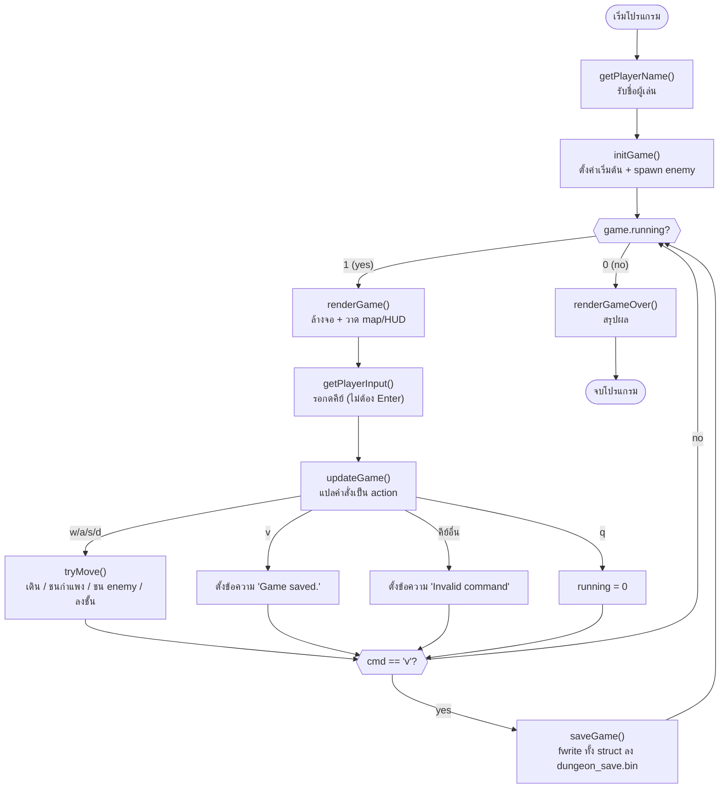
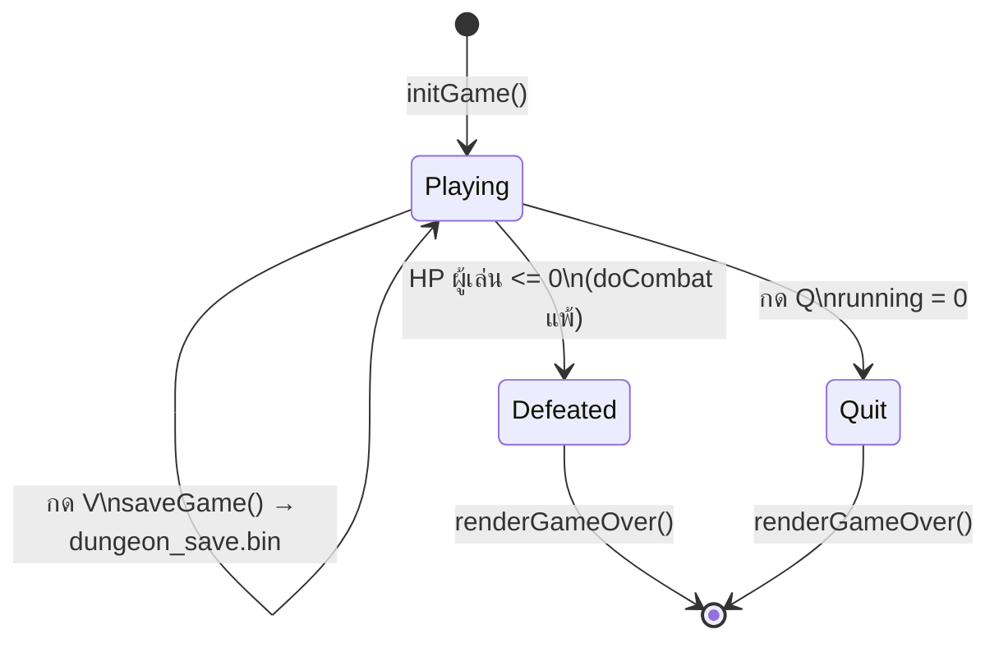

# Week 12 — Single-File Example (Dungeon Explorer)

เกมเดียวกับ [../dungeon_multi_file/](../dungeon_multi_file/) แต่รวมทุกอย่าง (struct, logic, render, save, main) ไว้ใน `dungeon.c` ไฟล์เดียว

## ▶️ Compile & Run

```bash
gcc -std=c99 -Wall dungeon.c -o dungeon
./dungeon
```

## 🎮 วิธีเล่น

W/A/S/D หรือปุ่มลูกศร เดิน (กดปุ๊บขยับปั๊บ ไม่ต้องกด Enter, ชน `E` = ต่อสู้อัตโนมัติ, ถึง `>` = ลงชั้นถัดไป), V บันทึกเกม, Q ออก — บันทึก `dungeon_save.bin` เฉพาะตอนกด V เท่านั้น (ไม่ auto-save)

## 📚 ฟังก์ชัน Standard C99 ที่ใช้

| Header | ฟังก์ชัน | ใช้ทำอะไรในเกมนี้ |
|--------|----------|---------------------|
| `stdio.h` | `printf` | วาด HUD, map, ข้อความต่างๆ |
| `stdio.h` | `scanf` | รับชื่อผู้เล่นตอนเริ่มเกม (`getPlayerName`) |
| `stdio.h` | `snprintf` | สร้างข้อความ enemy/message แบบจำกัดความยาว กัน buffer overflow |
| `stdio.h` | `fopen` / `fclose` | เปิด/ปิดไฟล์ save (`dungeon_save.bin`) |
| `stdio.h` | `fwrite` / `fread` | เขียน/อ่าน `GameState` ทั้งก้อนแบบ binary |
| `stdlib.h` | `system` | สั่ง `cls` ล้างจอ terminal ก่อนวาดเฟรมใหม่ |
| `stdlib.h` | `srand` | สุ่ม seed ตอนเริ่มเกม (ใช้คู่กับ `time`) |
| `string.h` | `memset` | เคลียร์ `GameState` ทั้งก้อนเป็น 0 ตอน `initGame` |
| `string.h` | `strncpy` / `strcpy` | คัดลอกชื่อผู้เล่น/ข้อความลง struct |
| `time.h` | `time` | เวลาปัจจุบัน ใช้เป็น seed ให้ `srand` |

> **`conio.h`** (`getch`) ไม่ใช่ standard C99 — เป็น extension เฉพาะ Windows (MSVC/MinGW) ใช้เพื่อรับคีย์ทันทีโดยไม่ต้องกด Enter

## 🛠️ ฟังก์ชันที่พัฒนาขึ้นเอง

| กลุ่ม | ฟังก์ชัน | หน้าที่ |
|-------|----------|---------|
| Setup | `generateEnemy(Enemy*, int floor)` | สุ่มค่า hp/attack ของ enemy ตาม floor ปัจจุบัน |
| Setup | `spawnFloorEnemies(GameState*)` | เติม enemy pool ทุกครั้งที่ขึ้นชั้นใหม่ (reuse slot เดิม) |
| Setup | `initGame(GameState*, const char* name)` | ตั้งค่าเริ่มต้นทั้งหมดของเกม (player, floor, message, enemy pool) |
| Logic | `doCombat(GameState*, Enemy*)` | ต่อสู้อัตโนมัติจนฝ่ายใดฝ่ายหนึ่งตาย |
| Logic | `walkEnemies(GameState*)` | ให้ enemy ที่ active เดินเข้าหาผู้เล่น 1 ช่อง/turn |
| Logic | `checkCollisions(GameState*)` | เช็คว่าผู้เล่นเดินทับ enemy หรือไม่ → เข้าสู้ |
| Logic | `tryMove(GameState*, int dRow, int dCol)` | ขยับผู้เล่น + ชนกำแพง + ชน enemy + ลงชั้น |
| Logic | `updateGame(GameState*, char cmd)` | แปลคำสั่งผู้เล่น (w/a/s/d/v/q) เป็น action |
| Render | `printBar(int cur, int max, int width)` | วาด HP bar แบบ `[####    ]` |
| Render | `drawMap(const GameState*)` | วาด tilemap พร้อม player `@` และ enemy `E` |
| Render | `renderGame(const GameState*)` | ล้างจอ + วาด map + HUD ทั้งเฟรม |
| Render | `renderGameOver(const GameState*)` | สรุปผลตอนจบเกม |
| Input | `getPlayerName(char* name)` | รับชื่อผู้เล่นตอนเริ่ม (ต้องกด Enter) |
| Input | `getPlayerInput(void)` | รับคีย์ทันที รองรับ wasd + ปุ่มลูกศร |
| Save | `saveGame(const GameState*, const char* filename)` | เขียน `GameState` ทั้งก้อนลงไฟล์ binary |
| Save | `loadGame(GameState*, const char* filename)` | อ่าน `GameState` กลับจากไฟล์ binary |
| Entry | `main(void)` | game loop หลัก: draw → input → update → save (ถ้าสั่ง) |

## 🔄 Program Flow



## 🗂️ GameState — State Diagram



- **Playing** (`running = 1`) — วนอยู่ใน game loop, HP ผู้เล่น > 0
- **Defeated** — แพ้ต่อสู้ (`doCombat` ลด `player.hp` จนเหลือ 0) → `running = 0`
- **Quit** — ผู้เล่นกด Q → `running = 0` ทันที (ไม่ต้องรอ HP หมด)
- ทั้งสองทางออกจบที่ `renderGameOver()` เหมือนกัน เพราะเช็คแค่ `game.running` ค่าเดียว
