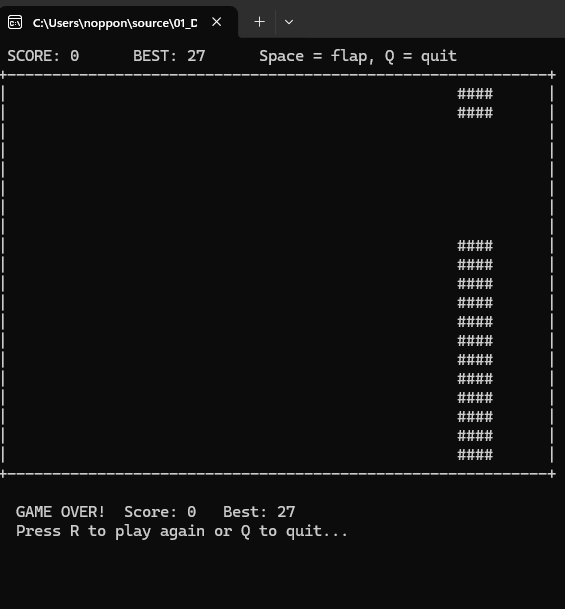
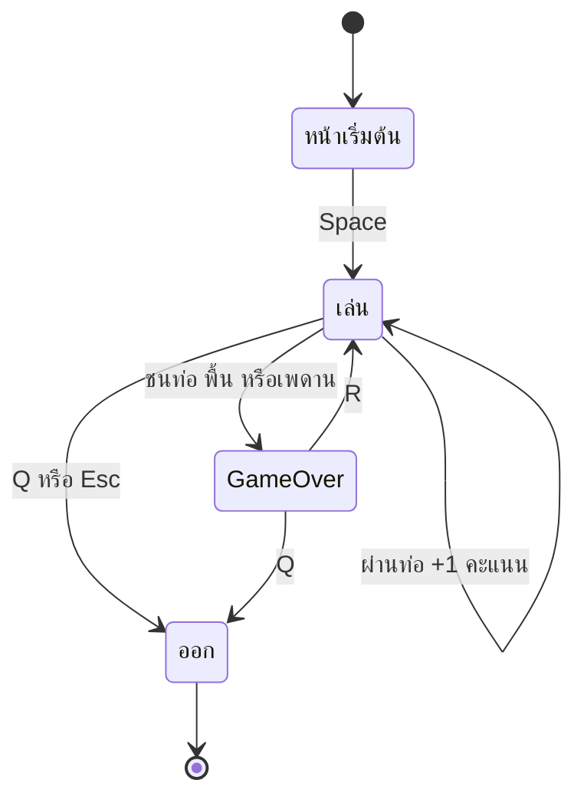

# Flappy-Bird — Game Design Document

## 🎯 Overview

| หัวข้อ                   | รายละเอียด                                                                                                                                    |
| ------------------------------ | ------------------------------------------------------------------------------------------------------------------------------------------------------- |
| ชื่อเกม                 | Flappy Bird (Console)                                                                                                                                   |
| แนว                         | Arcade — เล่นคนเดียว                                                                                                                        |
| แพลตฟอร์ม             | Windows Console (`conio.h`, `windows.h`)                                                                                                            |
| ภาษา / มาตรฐาน      | C99                                                                                                                                                     |
| เป้าหมายผู้เล่น | กระพือปีกให้นกลอดช่องว่างระหว่างท่อให้ได้มากที่สุด โดยไม่ชนท่อ พื้น หรือเพดาน |

> เขียนใหม่ด้วย C ล้วนจากไอเดียของ "Terminal Bird" (Ibrahimbag) ซึ่งเดิมใช้ ncurses / SDL2 / SQLite / cJSON



## 🎮 วิธีเล่น

### ปุ่มควบคุม

| ปุ่ม                   | การกระทำ                          |
| -------------------------- | ----------------------------------------- |
| `Space` / `W` / `↑` | กระพือปีก (นกพุ่งขึ้น) |
| `R`                      | เล่นใหม่ (หลัง GAME OVER)     |
| `Q` / `Esc`            | ออกจากเกม                        |

### ช่วงของเกม (State Diagram)



### กติกา

- นกอยู่ที่คอลัมน์คงที่ ท่อเลื่อนเข้ามาจากขวา
- ผ่านท่อ 1 คู่ → **+1 คะแนน**
- ชนท่อ / พื้น / เพดาน → GAME OVER
- ช่องว่างของท่อถัดไปเลื่อนจากท่อก่อนหน้าไม่เกิน 5 แถว เพื่อให้ผ่านได้จริง
- คะแนนสูงสุด (BEST) บันทึกลง `highscore.txt` และโหลดกลับมาเมื่อเปิดเกมใหม่

## 🧩 องค์ประกอบในเกม

| องค์ประกอบ | จำนวน / ขนาด                                    | หมายเหตุ                                                                          |
| -------------------- | -------------------------------------------------------- | ----------------------------------------------------------------------------------------- |
| สนาม             | 60 × 20 ช่อง (`FIELD_W` × `FIELD_H`)           | มีกรอบ `+---+` และ `\|`                                                       |
| นก                 | 1 ตัว (`O>`)                                        | คอลัมน์`BIRD_X` = 10                                                             |
| ท่อ               | สูงสุด 4 อันพร้อมกัน (`MAX_PIPES`)    | กว้าง 4, ช่องว่าง 6 แถว, ห่างกัน 24 ช่อง, วาดด้วย `#` |
| ฟิสิกส์       | `GRAVITY` 0.25, `JUMP_SPEED` −1.2, `MAX_FALL` 1.2 | ค่าต่อ 1 tick                                                                       |
| Tick                 | 70 ms (`TICK_MS`)                                      | ก้าวของเกม ≈ 14 tick/วินาที                                              |

## 🏗️ สถาปัตยกรรม (Single-File)

อยู่ใน [main.c](main.c) — แบ่งเป็นกลุ่มฟังก์ชันตามคอมเมนต์ `/* --- */`

```
main ─► playRound() ◄── วน Game Loop 1 รอบเกม
            ├► resetGame / spawnPipe / lastPipeIndex   (pipes)
            ├► birdCrashed                              (collision)
            └► render                                   (วาดทั้งเฟรม)
      ├► loadBest / saveBest                            (file I/O)
      └► waitForKey / hideCursor / clearScreen          (console helpers)
```

## ⚙️ ระบบที่เขียน

### 1. Game Loop (ตัวจับเวลาแบบ tick)

```c
while (1) {
    // INPUT  : while (kbhit()) → flap / quit
    // UPDATE : ถ้าผ่าน TICK_MS → gravity, เลื่อนท่อ, นับคะแนน, สร้างท่อใหม่, render
    // CHECK  : birdCrashed()
    Sleep(5);
}
```

การอ่านปุ่มทำทุกรอบของ loop แต่ฟิสิกส์ขยับเฉพาะเมื่อ `GetTickCount()` ผ่านไป ≥ 70 ms

### 2. ฟิสิกส์ของนก

```c
birdSpeed += GRAVITY;                 // เร่งลง
if (birdSpeed > MAX_FALL) birdSpeed = MAX_FALL;
birdY += birdSpeed;                   // ตำแหน่งเป็น float, ปัดเป็นแถวตอนวาด
```

กระพือปีก = ตั้ง `birdSpeed = JUMP_SPEED` (ค่าลบ = ขึ้น)

### 3. Object Pool ของท่อ

`Pipe pipes[MAX_PIPES]` พร้อมธง `active` — ไม่ `malloc` ทุกเฟรม ท่อที่ออกนอกจอเปลี่ยนเป็น `active = 0` แล้วนำช่องกลับมาใช้ใหม่ใน `spawnPipe`

### 4. Collision (`birdCrashed`)

- แถวของนก (`(int)(birdY + 0.5)`) นอกช่วง 0…`FIELD_H-1` → ชน
- ถ้าคอลัมน์นกอยู่ในความกว้างของท่อ และแถวนกอยู่นอกช่องว่าง → ชน

### 5. Rendering

- สร้างเฟรมใน `char field[][]` → `sprintf` ต่อเข้า buffer เดียว → `fputs` ครั้งเดียว
- ใช้ `SetConsoleCursorPosition(0,0)` แทนการล้างจอ — **ไม่กะพริบ**

### 6. High Score (File I/O)

`loadBest()` อ่านค่าจาก `highscore.txt` ตอนเริ่ม, `saveBest()` เขียนทับเมื่อทำลายสถิติ

## 🧰 สรุปฟังก์ชันที่นำมาประยุกต์ใช้

### ฟังก์ชันที่เขียนเอง

| ฟังก์ชัน                     | หน้าที่                                                                        | Parameter / Return                                              |
| ------------------------------------ | ------------------------------------------------------------------------------------- | --------------------------------------------------------------- |
| `resetGame()`                      | ตั้งค่าเริ่มต้นของรอบใหม่                                    | – /`void`                                                    |
| `spawnPipe(int previousGap)`       | สร้างท่อใหม่ที่ขอบขวา ช่องว่างขยับไม่เกิน ±5 | ตำแหน่งช่องว่างเดิม /`void`                |
| `lastPipeIndex()`                  | หาท่อที่อยู่ขวาสุด                                                  | คืน index หรือ −1                                       |
| `birdCrashed()`                    | ตรวจชน พื้น / เพดาน / ท่อ                                           | คืน 0 หรือ 1                                             |
| `render()`                         | วาดเฟรมทั้งหมดในครั้งเดียว                                  | – /`void`                                                    |
| `playRound()`                      | เล่น 1 รอบ                                                                     | คืน 1 ถ้าผู้เล่นต้องการออกโปรแกรม |
| `waitForKey(const char *keys)`     | รอกดปุ่มที่กำหนด                                                      | คืนปุ่มที่กด                                        |
| `loadBest()` / `saveBest(int)`   | อ่าน / เขียน high score                                                      | `int` / `void`                                              |
| `hideCursor()` / `clearScreen()` | ซ่อน cursor / ล้างจอ                                                        | – /`void`                                                    |

### ฟังก์ชันมาตรฐาน / Windows API ที่เรียกใช้

| Header        | ฟังก์ชัน                                                                 | ใช้ทำอะไรในเกม                                         |
| ------------- | -------------------------------------------------------------------------------- | -------------------------------------------------------------------- |
| `stdio.h`   | `fopen`, `fscanf`, `fprintf`, `fclose`                                   | อ่าน/เขียน `highscore.txt`                                |
| `stdio.h`   | `sprintf`, `fputs`                                                           | สร้างเฟรมใน buffer แล้วพิมพ์ครั้งเดียว |
| `stdlib.h`  | `rand`, `srand`, `system("cls")`                                           | สุ่มตำแหน่งช่องว่าง / ล้างจอ                |
| `conio.h`   | `kbhit`, `getch`                                                             | อ่านปุ่มแบบ non-blocking                                  |
| `windows.h` | `GetTickCount`, `Sleep`                                                      | ตัวจับเวลา tick / พัก CPU                               |
| `windows.h` | `SetConsoleCursorPosition`, `GetConsoleCursorInfo`, `SetConsoleCursorInfo` | วาดทับจุดเดิม / ซ่อน cursor                         |

### แนวคิดที่นำมาใช้

| แนวคิด                             | ตัวอย่างในโค้ด           | ประโยชน์                                   |
| ---------------------------------------- | -------------------------------------- | -------------------------------------------------- |
| `#define` ค่าปรับแต่งเกม | `GRAVITY`, `PIPE_GAP`, `TICK_MS` | ปรับความยากที่เดียว             |
| `struct` + array                       | `Pipe pipes[MAX_PIPES]`              | จัดกลุ่มข้อมูลของแต่ละท่อ |
| Object Pool                              | ธง `active`                        | ไม่ต้อง `malloc` ทุกเฟรม           |
| `static` global                        | `birdY`, `score`, `best`         | state ที่ใช้ร่วมกันทั้งไฟล์   |
| File I/O                                 | `loadBest` / `saveBest`            | เก็บสถิติข้ามการเล่น           |
| Non-blocking input                       | `kbhit()`                            | เกมไม่หยุดรอปุ่ม                   |
| Scan code ของปุ่มพิเศษ       | `key == 0 \|\| key == 224`             | อ่านปุ่มลูกศร (2 byte)                |

## ⚠️ ข้อจำกัดที่ทราบ

- ทำงานบน Windows เท่านั้น
- ตำแหน่งท่อและนกก้าวตาม tick คงที่ 70 ms จึงไม่ใช้ delta time
- ไม่มีเสียงและไม่มีระดับความยากที่เพิ่มขึ้นตามคะแนน
- `highscore.txt` ถูกอ่าน/เขียนที่ working directory ปัจจุบัน — ควรรันจากโฟลเดอร์เดียวกับโปรแกรม

## 🔧 Compile & Run

```bash
gcc -std=c99 -Wall main.c -o main
./main
```

## 💡 แนวทางต่อยอด (แบบฝึกหัด)

1. เพิ่มความเร็วท่อตามคะแนน (ลด `TICK_MS`)
2. ทำให้ช่องว่างแคบลงเมื่อระดับสูงขึ้น
3. เปลี่ยนมาใช้ delta time แทน tick คงที่
4. แยก logic ออกจาก render เป็นหลายไฟล์เหมือน Breakout `multi-files/`
5. ย้ายไป Raylib โดยเก็บตรรกะไว้เหมือนเดิม
