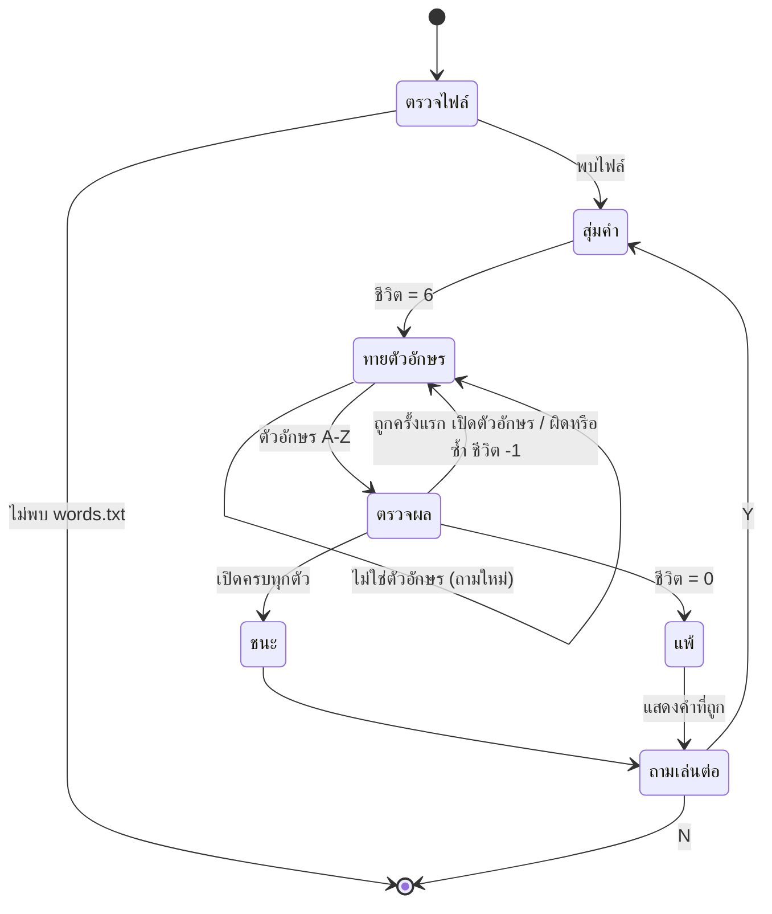

# Hangman — Game Design Document

## 🎯 Overview

| หัวข้อ | รายละเอียด |
|--------|-----------|
| ชื่อเกม | Hangman (Console) — "HANGMAN BY ZABE" |
| แนว | Word game / เกมทายคำ — เล่นคนเดียว |
| แพลตฟอร์ม | Windows Console (ใช้รหัสอักขระ CP437 วาดกรอบ) — คำสั่งล้างจอ `@cls\|\|clear` ทำให้รันบน Linux ได้บางส่วน |
| ภาษา / มาตรฐาน | C99 |
| เป้าหมายผู้เล่น | ทายตัวอักษรของคำภาษาอังกฤษให้ครบก่อนที่ชีวิต 6 ครั้งจะหมด |

> ต้นฉบับ: "Hangman Game by Zabe" — เผยแพร่ภายใต้ GNU GPL v3 (ดูไฟล์ [LICENSE](LICENSE)) เอกสารนี้เขียนใหม่ให้ตรงกับโครงสร้างของวิชา

## 🎮 วิธีเล่น

### การควบคุม

| การป้อน | การกระทำ |
|---------|---------|
| ตัวอักษร `A`–`Z` / `a`–`z` + `Enter` | ทายตัวอักษร (ไม่แยกตัวพิมพ์เล็ก/ใหญ่, ตัวอื่นจะถามใหม่) |
| `Y` / `y` + `Enter` | เล่นอีกรอบ (ตอนจบรอบ) |
| `N` / `n` + `Enter` | เลิกเล่น |

### ช่วงของเกม (State Diagram)



### กติกา

- เริ่มด้วย **6 ชีวิต** — คำถูกสุ่มจาก `words.txt` และแสดงเป็นเส้น `_` ตามจำนวนตัวอักษร
- ทายตัวอักษรที่มีในคำ (ครั้งแรก) → ตัวอักษรนั้นถูกเปิดในทุกตำแหน่ง ไม่เสียชีวิต
- ทายตัวอักษรที่ **ไม่มีในคำ** → เสีย 1 ชีวิต และเพิ่มตัวอักษรนั้นในรายการ "Incorrect letters"
- ทายตัวอักษรที่เปิดไปแล้ว หรือที่เคยทายผิดแล้ว → **เสีย 1 ชีวิตอีกครั้ง** (เกมแจ้งข้อความเตือน)
- เปิดครบทุกตัว → ชนะ · ชีวิตเหลือ 0 → แพ้ และเฉลยคำที่ถูก

### ภาพผู้ถูกแขวน (แต่ละชีวิตที่เสีย วาดเพิ่มทีละส่วน)

| ชีวิตที่เหลือ | ส่วนที่ปรากฏ |
|:------------:|-------------|
| 6 | เสาแขวนเปล่า |
| 5 | หัว |
| 4 | ลำตัว |
| 3 | แขนซ้าย |
| 2 | แขนขวา |
| 1 | ขาซ้าย |
| 0 | ขาขวา (ภาพครบ = แพ้) |

## 🧩 องค์ประกอบในเกม

| องค์ประกอบ | รายละเอียด | หมายเหตุ |
|-----------|-----------|---------|
| คลังคำ | [words.txt](words.txt) — 56 บรรทัด บรรทัดละ 1 คำ | เพิ่มคำได้ตามต้องการ |
| ชีวิต | 6 | ตัวแปร `lives` |
| คำที่ถูก / คำปัจจุบัน | `correctWord[200]` / `currentWord[200]` | เก็บเป็นตัวพิมพ์ใหญ่ |
| ตัวอักษรที่ผิด | `incorrectLetters[27]` | แสดงในรูป `(A, B, C)` |
| หัวข้อกรอบ | ฟังก์ชัน `printTitle` | วาดด้วยอักขระบล็อก CP437 |

## 🏗️ สถาปัตยกรรม (Single-File)

โค้ดอยู่ใน [hangman.c](hangman.c) — `main()` เก็บ game loop และมีฟังก์ชันช่วยเล็ก ๆ ประกาศ prototype ไว้ด้านบน

```
main ─► countlines()          นับบรรทัดของ words.txt
     ├► [สุ่มคำ] fopen + fgets
     ├► toCaps / isLetter     แปลงและตรวจตัวอักษร
     ├► isIn                  ตรวจว่าตัวอักษรอยู่ในสตริงหรือไม่
     ├► printHangman(lives)   วาดภาพตามชีวิตที่เหลือ
     ├► printTitle(text)      วาดหัวข้อ
     └► printLetters(str)     แสดงตัวอักษรที่ทายผิด
```

ไฟล์ข้อมูล: [words.txt](words.txt) (คลังคำ) — ต้องอยู่ใน working directory เดียวกับโปรแกรม

## ⚙️ ระบบที่เขียน

### 1. Game Loop สองชั้น

```c
while (keepPlaying == 'Y' || keepPlaying == 'y') {   // วนเล่นหลายรอบ
    // สุ่มคำ, ตั้ง lives = 6
    while (lives > 0 && !win) {                       // 1 รอบเกม
        // แสดงคำ / ภาพ / ตัวอักษรที่ผิด → รับตัวอักษร → ตรวจผล
    }
    // แสดงผลแพ้/ชนะ แล้วถามว่าจะเล่นต่อไหม
}
```

### 2. การสุ่มคำจากไฟล์ (File I/O)

`countlines("words.txt")` นับจำนวนบรรทัด → `rand() % จำนวนบรรทัด` → อ่านไฟล์ทีละบรรทัดด้วย `fgets` จนถึงบรรทัดที่ต้องการ

### 3. การแสดงคำที่ซ่อนอยู่

`currentWord` เริ่มเป็น `_` ทุกตำแหน่ง เมื่อทายถูกจะวน `correctWord` แล้วคัดลอกตัวอักษรนั้นลงตำแหน่งที่ตรงกัน ชนะเมื่อ `strcmp(currentWord, correctWord) == 0`

### 4. การตรวจตัวอักษร

`isLetter` ตรวจช่วงรหัส ASCII (65–90, 97–122), `toCaps` แปลงพิมพ์เล็กเป็นพิมพ์ใหญ่ด้วย `c - 32`, `isIn` ค้นตัวอักษรในสตริงด้วย loop

### 5. Rendering

- `system("@cls||clear")` ล้างจอทุกรอบของการทาย
- ภาพผู้ถูกแขวนและกรอบหัวข้อวาดด้วย `printf("%c", รหัสตัวเลข)` เช่น 201 `╔`, 205 `═`, 186 `║`

## 🧰 สรุปฟังก์ชันที่นำมาประยุกต์ใช้

### ฟังก์ชันที่เขียนเอง

| ฟังก์ชัน | หน้าที่ | Parameter / Return |
|---------|--------|--------------------|
| `printHangman(int lives)` | วาดภาพตามชีวิตที่เหลือด้วย `switch` | ชีวิต 0–6 / `void` |
| `printTitle(char a[])` | วาดกรอบหัวข้อรอบข้อความ | สตริง / `void` |
| `toCaps(char c)` | แปลงตัวพิมพ์เล็กเป็นพิมพ์ใหญ่ | `char` / คืน `char` |
| `isLetter(char c)` | ตรวจว่าเป็นตัวอักษร | คืน 0 หรือ 1 |
| `isIn(char str[], char c)` | ค้นตัวอักษรในสตริง | คืน 0 หรือ 1 |
| `printLetters(char str[])` | แสดงตัวอักษรที่ผิดในวงเล็บ | สตริง / `void` |
| `countlines(char *filename)` | นับจำนวนบรรทัดของไฟล์ | ชื่อไฟล์ / คืน `int` |

### ฟังก์ชันมาตรฐานที่เรียกใช้

| Header | ฟังก์ชัน | ใช้ทำอะไรในเกม |
|--------|---------|----------------|
| `stdio.h` | `printf`, `scanf` | แสดงผล / รับตัวอักษร |
| `stdio.h` | `fopen`, `fgets`, `fgetc`, `fclose` | อ่าน `words.txt` |
| `stdlib.h` | `rand`, `srand`, `system` | สุ่มคำ / ล้างจอ |
| `string.h` | `strcpy`, `strcmp`, `strlen` | คัดลอก / เทียบ / วัดความยาวสตริง |
| `time.h` | `time`, `clock` | seed ของ `srand` / หน่วงเวลาก่อนปิด |

### แนวคิดการเขียนฟังก์ชันที่นำมาใช้

| แนวคิด | ตัวอย่างในโค้ด | ประโยชน์ |
|--------|---------------|---------|
| Function prototype | ประกาศฟังก์ชันไว้เหนือ `main` | เรียกใช้ก่อนนิยามได้ |
| Array ของ `char` เป็น string | `correctWord[200]`, `currentWord[200]` | เก็บ/แก้ไขคำทีละตัว |
| Loop ซ้อน loop | game loop ในเกมหลายรอบ | แยกระดับ "เกมทั้งหมด" กับ "1 รอบ" |
| `switch` | `printHangman` | เลือกภาพตามค่า `lives` |
| File I/O | `fopen`, `fgets` | โหลดข้อมูลคำจากไฟล์ภายนอก |
| ฟังก์ชันช่วยตรวจเงื่อนไข | `isLetter`, `isIn` | แยกตรรกะเล็ก ๆ ออกจาก `main` |

## ⚠️ ข้อจำกัดที่ทราบ

โค้ดต้นฉบับนี้ใช้เป็นตัวอย่างการอ่านโค้ดของคนอื่น — จุดที่ควรระวัง (อ่านจากโค้ด ไม่ได้ทดสอบครบทุกกรณี):

| ประเด็น | รายละเอียด |
|---------|-----------|
| รหัสอักขระ CP437 | กรอบและภาพผู้ถูกแขวนแสดงถูกต้องเมื่อ console ใช้ code page 437; ถ้าเปลี่ยนเป็น UTF-8 (65001) จะเห็นเป็นตัวอักษรเพี้ยน |
| `fflush(stdin)` | พฤติกรรมไม่ถูกกำหนดในมาตรฐาน C ใช้ได้กับ MSVC/MinGW บน Windows แต่ไม่พกพา |
| `toCaps` ไม่ `return` ทุกเส้นทาง | ถ้าไม่ใช่ตัวอักษร (เช่น `\n`, `\r`) จะไม่คืนค่า และตัวเรียกวนแปลง 200 ตัวรวมส่วนที่ไม่ถูกกำหนดค่า ผลอาจต่างกันตามคอมไพเลอร์ |
| การอ่านคำจาก `words.txt` | ตัวอักษรขึ้นบรรทัดใหม่ (รวม `\r` ของไฟล์แบบ CRLF) ไม่ได้ถูกตัดออกจากคำ และตัวเลขบรรทัดที่สุ่มมี off-by-one เล็กน้อย ทำให้คำแรกของไฟล์แทบไม่ถูกสุ่ม |
| `countlines` | ตัวแปร `c` ไม่ได้กำหนดค่าเริ่มต้นก่อนเข้า loop |
| ทายซ้ำเสียชีวิต | เป็นกติกาของเกมนี้โดยตั้งใจ แต่ต่างจาก Hangman ทั่วไป |
| คำมีความยาวสูงสุด 200 ตัวอักษร | `correctWord` / `currentWord` ไม่ตรวจขอบเขต |
| ไม่มี high score / ไม่มีระดับความยาก | |

## 🔧 Compile & Run

```bash
gcc -std=c99 -Wall main.c -o hangman
./hangman
```

> ต้องรันจากโฟลเดอร์ที่มี `words.txt` (ถ้าไม่พบ เกมจะแสดง "Error: words.txt not found" แล้วจบ)

## 💡 แนวทางต่อยอด (แบบฝึกหัด)

1. ตัดอักขระขึ้นบรรทัดใหม่ (`\n`, `\r`) ออกจากคำหลัง `fgets`
2. ไม่หักชีวิตเมื่อทายตัวอักษรซ้ำ (ตามกติกา Hangman ทั่วไป)
3. เพิ่มหมวดคำ / ระดับความยากจากหลายไฟล์
4. เพิ่ม high score หรือสถิติชนะ/แพ้ลงไฟล์ (Week 11: File I/O)
5. แก้ `toCaps` ให้คืนค่าทุกเส้นทาง และเปลี่ยนจาก `fflush(stdin)` เป็นวิธีล้าง buffer ที่พกพาได้
6. ปรับภาพผู้ถูกแขวนเป็น ASCII ล้วนเพื่อให้รันได้ทุก terminal
