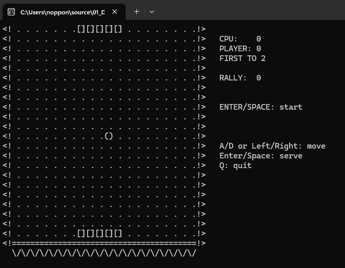

# PingPong — Game Design Document

## 🎯 Overview

| หัวข้อ                   | รายละเอียด                                                                                                                                                              |
| ------------------------------ | --------------------------------------------------------------------------------------------------------------------------------------------------------------------------------- |
| ชื่อเกม                 | Ping Pong (Console, แนวตั้ง)                                                                                                                                               |
| แนว                         | Arcade — ผู้เล่น vs CPU                                                                                                                                                   |
| แพลตฟอร์ม             | Windows Console (`windows.h`, `conio.h`)                                                                                                                                      |
| ภาษา / มาตรฐาน      | C99                                                                                                                                                                               |
| เป้าหมายผู้เล่น | ใช้ไม้ล่างสะท้อนลูกขึ้นไป ให้ลูกผ่านไม้ CPU ด้านบนก่อน — ชนะให้ได้**2 แต้ม** (ปรับด้วย `WIN_SCORE`) |

> ดัดแปลงจาก [ajfvdev/Ping-Pong-Game](https://github.com/ajfvdev/Ping-Pong-Game) (Alfredo Flores) — เขียนใหม่เป็นแนวตั้ง และจัดหน้าจอแบบเดียวกับ Tetris / Snake (กรอบ `<! !>` + แผงข้อมูลด้านข้าง)



## 🎮 วิธีเล่น

### ปุ่มควบคุม

| ปุ่ม       | การกระทำ                                               |
| -------------- | -------------------------------------------------------------- |
| `A` / `←` | เลื่อนไม้ผู้เล่น (ล่าง) ไปทางซ้าย |
| `D` / `→` | เลื่อนไม้ผู้เล่น ไปทางขวา              |
| `Q`          | ออกจากเกม                                             |

### ตัวอย่างหน้าจอ

```
<! [][][][][] !>   CPU:    0
<!  .  .  .  . !>   PLAYER: 0
<!  .  .  () . !>   FIRST TO 2
<!  .  .  .  . !>
<!  .  .  .  . !>   RALLY:  0
<! [][][][][] !>   A/D or Left/Right: move
<!========================================!>
```

### กติกา

- ไม้ CPU อยู่ **บน** ไม้ผู้เล่นอยู่ **ล่าง** ลูกเด้งขอบซ้าย/ขวาเอง
- ลูกผ่านไม้ CPU → **ผู้เล่นได้ 1 แต้ม** / ลูกผ่านไม้ผู้เล่น → **CPU ได้ 1 แต้ม**
- ชนไม้ตรงกลาง ลูกไปทางเดิม แต่ชนตรงขอบไม้ซ้าย/ขวา ลูกจะเปลี่ยนไปทางนั้น
- ยิ่งตีโต้ (`RALLY`) ได้ต่อเนื่อง ลูกยิ่งเร็วขึ้น (ถึงขีดจำกัด `MIN_DELAY_MS`)
- หลังได้แต้ม ลูกกลับไปกลางสนาม และส่งไปทางฝ่ายที่เสียแต้ม

## 🧩 องค์ประกอบในเกม

| องค์ประกอบ | ขนาด                                  | หมายเหตุ                                                         |
| -------------------- | ----------------------------------------- | ------------------------------------------------------------------------ |
| สนาม             | 20 × 22 ช่อง                         | 1 ช่องวาดกว้าง 2 ตัวอักษร (`FIELD_W`, `FIELD_H`) |
| ไม้               | กว้าง 5 ช่อง (`[]`)            | ไม้ CPU แถวบนสุด, ไม้ผู้เล่นแถวล่างสุด    |
| ลูก               | 1 ช่อง (`()`)                       | เคลื่อนแนวทแยง ±1 ต่อ step                             |
| ความเร็ว     | 90 ms ต่อ step → ลดลงถึง 45 ms | ใช้`GetTickCount` (fixed timestep)                                  |

## 🏗️ สถาปัตยกรรม (Single-File)

อยู่ใน [main.c](main.c) — state ทั้งหมดเป็นตัวแปร `static` ระดับไฟล์ (`playerX`, `cpuX`, `ball`, คะแนน)

```
main ─► input (A/D, ลูกศร, Q)
     ├► moveCpu()   ─► CPU ตามลูก (ช้ากว่าลูกเล็กน้อย)
     ├► moveBall()  ─► เด้งผนัง / เช็กไม้ / คืนผลแต้ม
     └► render()    ─► สร้างทั้งเฟรมลง buffer แล้ว fputs ครั้งเดียว
```

## ⚙️ ระบบที่เขียน

### 1. Game Loop

```c
while (!quit && playerScore < WIN_SCORE && cpuScore < WIN_SCORE) {
    // input: kbhit/getch
    // ทุก interval ms: moveCpu(); moveBall(); ตรวจแต้ม
    // ถ้ามีอะไรเปลี่ยน: render();
    Sleep(10);
}
```

### 2. Collision (`moveBall`)

| เงื่อนไข                                                    | ผลลัพธ์                                                 |
| ------------------------------------------------------------------- | -------------------------------------------------------------- |
| x ชนผนังซ้าย/ขวา                                       | กลับทิศ `dx`                                          |
| ลูกถึงแถวบน และไม้ CPU ครอบ x                  | กลับทิศ `dy` + ปรับ `dx` ตามจุดที่ชน |
| ลูกถึงแถวบน แต่ไม้ CPU ไม่ครอบ              | ผู้เล่นได้แต้ม                                   |
| ลูกถึงแถวล่าง และไม้ผู้เล่นครอบ x     | กลับทิศ `dy` + ปรับ `dx`                        |
| ลูกถึงแถวล่าง แต่ไม้ผู้เล่นไม่ครอบ | CPU ได้แต้ม                                             |

### 3. AI ของ CPU

ไม้ CPU เลื่อนเข้าหา x ของลูกครั้งละ 1 ช่อง แต่ **ข้ามทุก step ที่ 3** จึงช้ากว่าลูกเล็กน้อย ผู้เล่นชนะได้ด้วยการตีมุมให้ลูกไปทางขอบ

### 4. Rendering

- `SetConsoleCursorPosition` กลับมุมซ้ายบน แทนการ `cls` ทุกเฟรม → ไม่กะพริบ
- วาดเฉพาะเมื่อมีการเปลี่ยนแปลง (`dirty`)

## 🔧 Compile & Run

```bash
gcc -std=c99 -Wall main.c -o main
./main
```

## 💡 แนวทางต่อยอด (แบบฝึกหัด)

1. ปรับความยาก: เปลี่ยน `PADDLE_W`, จังหวะข้ามของ CPU หรือ `WIN_SCORE`
2. เพิ่มเมนูหยุดเกม (`P`)
3. เพิ่มโหมด 2 ผู้เล่น (`A/D` และ `←/→`)
4. แทนตัวแปร `static` ด้วย struct `Game` แล้วส่งด้วย pointer (แบบเดียวกับ Snake)
