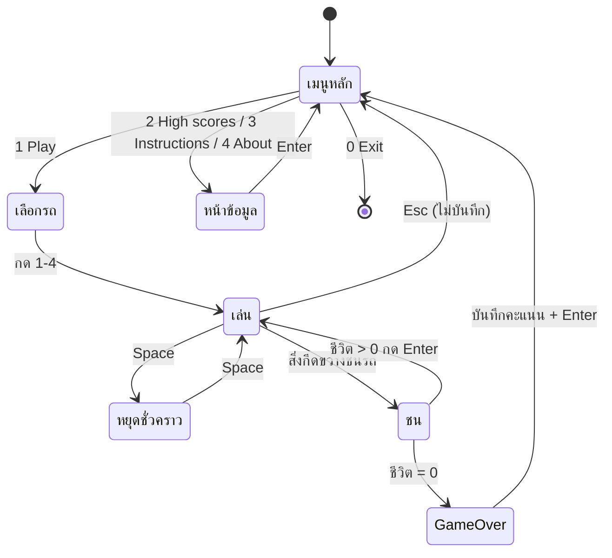

# Racing-Drag-n-Drive — Game Design Document

## 🎯 Overview

| หัวข้อ | รายละเอียด |
|--------|-----------|
| ชื่อเกม | Drag 'n' Drive (Console) |
| แนว | Arcade / Endless dodge — เล่นคนเดียว |
| แพลตฟอร์ม | Windows Console (`conio.h`, `windows.h`) |
| ภาษา / มาตรฐาน | C99 |
| เป้าหมายผู้เล่น | บังคับรถหลบสิ่งกีดขวางที่ตกลงมา ทำคะแนนให้สูงสุดโดยมีชีวิต 3 ครั้ง |

> เขียนใหม่ด้วย C ล้วนจากไอเดียเกม "Drag 'n' Drive" ของ Rupali Singh และ Aniket Kumar (Apache License 2.0) ซึ่งเดิมใช้ Turbo C `graphics.h`

## 🎮 วิธีเล่น

### ปุ่มควบคุม

| ปุ่ม | การกระทำ |
|------|---------|
| `A` / `←` | เลื่อนรถซ้าย (ครั้งละ 2 ช่อง) |
| `D` / `→` | เลื่อนรถขวา (ครั้งละ 2 ช่อง) |
| `Space` | หยุดชั่วคราว / เล่นต่อ |
| `Esc` | กลับเมนูหลัก |
| `Enter` | ยืนยันในหน้าจอต่าง ๆ / เล่นต่อหลังชน |
| `1`–`4` | เลือกรถ / เลือกเมนู |

### ช่วงของเกม (State Diagram)



### กติกา

- เริ่มด้วย **3 ชีวิต** — ชนสิ่งกีดขวาง (`XXX`) เสีย 1 ชีวิต
- สิ่งกีดขวางผ่านรถไปได้โดยไม่ชน → **+10 คะแนน**
- ยิ่งคะแนนสูง ถนนยิ่งเร็วขึ้น (ระดับ level คำนวณจากความเร็ว)
- หลังชนครั้งที่ยังมีชีวิตเหลือ สิ่งกีดขวางถูกวางใหม่ให้ตั้งตัวได้
- ผู้เล่นเลือกรูปรถได้ 4 แบบ: `[#]` `<O>` `/^\` `(=)`

## 🧩 องค์ประกอบในเกม

| องค์ประกอบ | จำนวน / ขนาด | หมายเหตุ |
|-----------|-------------|---------|
| ถนน | 24 × 20 ช่อง (`ROAD_W` × `ROAD_H`) | เส้นกลางประ `.` เลื่อนตาม `scroll` |
| รถผู้เล่น | กว้าง 3 ช่อง (`CAR_W`) | อยู่แถวล่างสุด |
| สิ่งกีดขวาง | 2 อันพร้อมกัน (`NUM_OBS`) กว้าง 3 | วาดเป็น `XXX` ตำแหน่ง x สุ่ม |
| ชีวิต | 3 (`MAX_LIVES`) | แสดง `<3` |
| อันดับคะแนน | 5 อันดับ (`TOP_SCORES`) | เก็บใน `myscore.txt` |

### ความเร็วตามคะแนน (`stepDelay`)

| คะแนน | ms ต่อก้าว |
|------:|----------:|
| < 50 | 150 |
| < 100 | 135 |
| < 200 | 120 |
| < 300 | 105 |
| < 400 | 90 |
| < 600 | 75 |
| ≥ 600 | 60 |

## 🏗️ สถาปัตยกรรม (Single-File)

อยู่ใน [main.c](main.c) — แบ่งกลุ่มตามคอมเมนต์ `/* --- */`

```
main ─► เมนูหลัก ─► playAndSave() ─► selectCar() ─► playGame() (Game Loop)
          ├► showHighScores / showInstructions / showAbout
          └► loadScores / saveScores / addScore     (file I/O)
     playGame ─► stepDelay / levelOf / placeObstacle / resetObstacles / hitsObstacle / render
```

## ⚙️ ระบบที่เขียน

### 1. Game Loop (tick ตามคะแนน)

```c
while (1) {
    // INPUT     : while (kbhit()) → เลื่อน / หยุด / ออก
    // ROAD STEP : ถ้าผ่าน stepDelay(score) → สิ่งกีดขวางเลื่อนลง 1 แถว
    // COLLISION : hitsObstacle() → ลดชีวิต
    // DRAW      : render() เมื่อ dirty
    Sleep(10);
}
```

เมื่อหยุดชั่วคราว จะรีเซ็ต `lastStep` เพื่อไม่ให้เวลาที่ผ่านไประหว่างหยุดถูกนับ

### 2. สิ่งกีดขวาง (Obstacle Recycling)

`Obstacle obs[NUM_OBS]` ถูกนำกลับมาใช้ซ้ำ — เมื่อออกนอกถนน (`y >= ROAD_H`) จะบวกคะแนนและ `placeObstacle(&obs[i], 0)` วางใหม่ด้านบน (ไม่ `malloc`)

### 3. การตรวจชน (`hitsObstacle`)

ตรวจเมื่อสิ่งกีดขวางอยู่แถวล่างสุด (`y == ROAD_H-1`) และช่วง x ซ้อนกับรถ (`-CAR_W < dx < CAR_W`)

### 4. อันดับคะแนน (File I/O)

`addScore` แทรกคะแนนเข้าลิสต์ที่เรียงจากมากไปน้อย (insertion) เลื่อนอันดับล่างลง แล้ว `saveScores` เขียน `myscore.txt` คืนค่า 1 ถ้าเป็นสถิติสูงสุดใหม่

### 5. Rendering

สร้างเฟรมใน `char road[][]` + `sprintf` ลง buffer เดียว → `fputs` และย้ายเคอร์เซอร์ไป (0,0) แทนการล้างจอ — ไม่กะพริบ

## 🧰 สรุปฟังก์ชันที่นำมาประยุกต์ใช้

### ฟังก์ชันที่เขียนเอง

| ฟังก์ชัน | หน้าที่ | Parameter / Return |
|---------|--------|--------------------|
| `loadScores()` / `saveScores()` | อ่าน / เขียน `myscore.txt` | – / `void` |
| `addScore(int score)` | แทรกคะแนนเข้าอันดับ | คืน 1 ถ้าเป็นสถิติสูงสุด |
| `showHighScores()` / `showInstructions()` / `showAbout()` | หน้าจอต่าง ๆ | `void` |
| `selectCar()` | เลือกรูปรถ | `void` |
| `stepDelay(int score)` / `levelOf(int score)` | ความเร็วและระดับตามคะแนน | คืน ms / level |
| `placeObstacle(Obstacle *o, int y)` | วางสิ่งกีดขวางที่ x สุ่ม | pointer / `void` |
| `resetObstacles(Obstacle obs[])` | จัดวางเริ่มต้นแบบกระจายห่างกัน | array / `void` |
| `hitsObstacle(const Obstacle obs[], int px)` | ตรวจชน | คืน 0/1 |
| `render(...)` | วาดเฟรมทั้งหมด | `void` |
| `playGame()` | เล่น 1 เกม | คืนคะแนน หรือ −1 ถ้ากด `Esc` |
| `playAndSave()` | เลือกรถ → เล่น → บันทึกคะแนน | `void` |
| `waitForKey(int key)` / `setCursorVisible(int)` / `clearScreen()` | ตัวช่วย console | `void` |

### ฟังก์ชันมาตรฐาน / Windows API ที่เรียกใช้

| Header | ฟังก์ชัน | ใช้ทำอะไรในเกม |
|--------|---------|----------------|
| `stdio.h` | `fopen`, `fscanf`, `fprintf`, `fclose` | อ่าน/เขียนอันดับคะแนน |
| `stdio.h` | `sprintf`, `fputs`, `printf` | วาดเฟรม / ข้อความ |
| `stdlib.h` | `rand`, `srand`, `system("cls")` | สุ่มตำแหน่ง / ล้างจอ |
| `string.h` | `memset`, `memcpy` | เตรียมแถวถนน / วางรถและสิ่งกีดขวางลงแถว |
| `time.h` | `time` | seed ของ `srand` |
| `conio.h` | `kbhit`, `getch` | อ่านปุ่มแบบ non-blocking รวมลูกศร |
| `windows.h` | `GetTickCount`, `Sleep` | ตัวจับเวลา tick / พัก CPU |
| `windows.h` | `SetConsoleCursorPosition`, `SetConsoleCursorInfo` | วาดทับจุดเดิม / ซ่อน cursor |

### แนวคิดที่นำมาใช้

| แนวคิด | ตัวอย่างในโค้ด | ประโยชน์ |
|--------|---------------|---------|
| `struct` + array | `Obstacle obs[NUM_OBS]` | จัดกลุ่มข้อมูลสิ่งกีดขวาง |
| `const` pointer / array | `hitsObstacle(const Obstacle obs[], …)` | ฟังก์ชันตรวจชนไม่แก้ข้อมูล |
| Lookup table | `CAR_GLYPH[4]` | เลือกรูปรถด้วย index |
| Insertion into sorted array | `addScore` | รักษาลำดับ Top 5 |
| Object recycling | `placeObstacle` | ไม่ต้อง `malloc` ทุกเฟรม |
| Dirty flag | `dirty` | วาดใหม่เฉพาะเมื่อมีการเปลี่ยน |
| File I/O | `loadScores` / `saveScores` | เก็บสถิติข้ามการเล่น |

## ⚠️ ข้อจำกัดที่ทราบ

- ทำงานบน Windows เท่านั้น
- ก้าวถนนตามตัวจับเวลา `stepDelay` ไม่ใช่ delta time เต็มรูปแบบ
- ตรวจชนเฉพาะตอนสิ่งกีดขวางอยู่แถวล่างสุดเท่านั้น
- ไม่มีเสียง และไม่มีรูปแบบสิ่งกีดขวางหลายชนิด
- ออกด้วย `Esc` กลางเกม คะแนนจะไม่ถูกบันทึก
- `myscore.txt` อ่าน/เขียนใน working directory ปัจจุบัน — ควรรันจากโฟลเดอร์เดียวกับโปรแกรม

## 🔧 Compile & Run

```bash
gcc -std=c99 -Wall main.c -o main
./main
```

## 💡 แนวทางต่อยอด (แบบฝึกหัด)

1. เพิ่มสิ่งกีดขวางหลายแบบ / มีรถวิ่งสวน
2. เพิ่มไอเทมเก็บ (โบนัสคะแนน / ชีวิต)
3. ให้ผู้เล่นกรอกชื่อคู่กับคะแนนใน High Score (ใช้ struct)
4. แยก logic กับ render เป็นหลายไฟล์ เหมือน Breakout `multi-files/`
5. ย้ายไป Raylib และใช้ delta time
