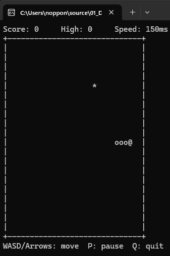
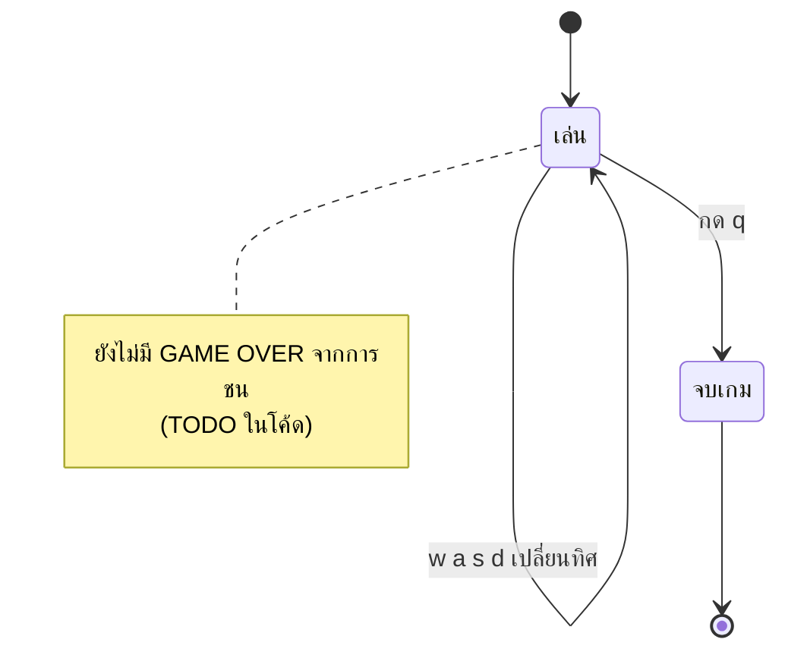

# Snake — Game Design Document

## 🎯 Overview

| หัวข้อ                   | รายละเอียด                                                                                                    |
| ------------------------------ | ----------------------------------------------------------------------------------------------------------------------- |
| ชื่อเกม                 | Snake (Console) —**เวอร์ชันโครงยังไม่สมบูรณ์**                                          |
| แนว                         | Arcade — เล่นคนเดียว                                                                                        |
| แพลตฟอร์ม             | Windows Console (`conio.h` — `_kbhit`, `_getch`)                                                                 |
| ภาษา / มาตรฐาน      | C99                                                                                                                     |
| เป้าหมายผู้เล่น | (ตามแนวเกม) บังคับงูกินอาหารให้ยาวขึ้นโดยไม่ชนกำแพงหรือตัวเอง |

> ดัดแปลงจาก [ajfvdev/Snake-Game](https://github.com/ajfvdev/Snake-Game/blob/master/snake%20game.c) — โค้ดชุดนี้เป็น **โครง (skeleton)** ที่ยังมี `TODO` ค้างอยู่ เหมาะใช้เป็นโจทย์ให้นักศึกษาเติมให้สมบูรณ์ ดูหัวข้อ [ข้อจำกัดที่ทราบ](#️-ข้อจำกัดที่ทราบ)



## 🎮 วิธีเล่น

### ปุ่มควบคุม

| ปุ่ม | การกระทำ                                 |
| -------- | ------------------------------------------------ |
| `w`    | เลี้ยวขึ้น                             |
| `a`    | เลี้ยวซ้าย                             |
| `s`    | เลี้ยวลง (ดู bug ในข้อจำกัด) |
| `d`    | เลี้ยวขวา                               |
| `q`    | ออกจากเกม                               |

ใช้ตัวพิมพ์เล็กเท่านั้น

### ช่วงของเกม (State Diagram)



### กติกา (ที่โค้ดปัจจุบันทำได้)

- งูเริ่มยาว 5 ปล้อง กลางกระดาน 20 × 20 เคลื่อนไปทางขวาเอง
- ทุก ๆ 100 ms งูเคลื่อนที่ 1 ช่อง ตามทิศล่าสุดที่กด
- **ยังไม่มี** อาหาร, คะแนน, การชนกำแพง/ตัวเอง

## 🧩 องค์ประกอบในเกม

| องค์ประกอบ | จำนวน / ขนาด                          | หมายเหตุ                                                               |
| -------------------- | ---------------------------------------------- | ------------------------------------------------------------------------------ |
| กระดาน         | 20 × 20 (`BOARD_WIDTH` × `BOARD_HEIGHT`) | `char board[20][20]`                                                         |
| งู                 | เริ่ม 5 ปล้อง (`SNAKE_LENGTH`)     | วาดด้วย `o`                                                           |
| อาหาร           | –                                             | โค้ดตรวจ `'X'` ไว้ แต่ยังไม่มีส่วนวางอาหาร |

## 🏗️ สถาปัตยกรรม (Single-File)

อยู่ใน [main.c](main.c) — ใช้ **linked list** เก็บตัวงู

```
snake ──► [หัว] ─► [ปล้อง] ─► … ─► [หาง] ─► NULL
             ▲
   ต่อปล้องใหม่ที่ "หัวรายการ" ทุกก้าว แล้วตัดหางทิ้ง
```

| ส่วน  | หน้าที่                              |
| --------- | ------------------------------------------- |
| `Point` | พิกัด `x`, `y`                     |
| `Node`  | 1 ปล้องของงู (`pos`, `next`)  |
| `snake` | pointer ไปยัง node หัวงู (global) |

## ⚙️ ระบบที่เขียน

### 1. Game Loop

```c
while (!game_over) {
    update_snake(dir, board);   // ขยับงู
    display_board(board);       // ล้างจอแล้ววาดใหม่
    if (_kbhit()) { ... }       // อ่านปุ่ม → เปลี่ยน dir
    // หน่วงเวลาด้วย clock() แบบ busy-wait ~100 ms
}
```

### 2. การเคลื่อนที่ของงู (`update_snake`)

ทุกก้าว: สร้าง node ใหม่ที่ตำแหน่งหัวใหม่ (`head + dir`) → ต่อเป็นหัวรายการ → (กรณีไม่ได้กินอาหาร) เดินหา node ก่อนสุดท้ายเพื่อลบหางและ `free` หน่วยความจำ

### 3. การสร้างงูตอนเริ่ม (`init_snake`)

`malloc` node ทีละปล้อง โดยแต่ละปล้องใหม่ชี้ `next` ไปหาปล้องก่อนหน้า และถอยตำแหน่ง x ไปทางซ้ายทีละ 1

### 4. การปล่อยหน่วยความจำ

ก่อนจบโปรแกรมวน `free` ทุก node ในรายการ

## 🧰 สรุปฟังก์ชันที่นำมาประยุกต์ใช้

### ฟังก์ชันที่เขียนเอง

| ฟังก์ชัน                   | หน้าที่                                 | Parameter / Return                |
| ---------------------------------- | ---------------------------------------------- | --------------------------------- |
| `init_snake()`                   | สร้าง linked list ของงู 5 ปล้อง | ไม่รับ /`void`            |
| `display_board(board)`           | ล้างจอ แล้วพิมพ์กระดาน    | array 2 มิติ /`void`        |
| `update_snake(Point dir, board)` | เพิ่มหัวใหม่ ลบหาง            | `dir` = ทิศทาง / `void` |

### ฟังก์ชันมาตรฐานที่เรียกใช้

| Header       | ฟังก์ชัน                        | ใช้ทำอะไรในเกม                                                |
| ------------ | --------------------------------------- | --------------------------------------------------------------------------- |
| `stdio.h`  | `putchar`, `printf`                 | วาดกระดานทีละตัวอักษร                                  |
| `stdlib.h` | `malloc`, `free`, `system("cls")` | จัดการ node / ล้างจอ                                            |
| `conio.h`  | `_kbhit`, `_getch`                  | ตรวจว่ามีปุ่มกด / อ่านปุ่มโดยไม่ต้อง Enter |
| `time.h`   | `clock`                               | หน่วงเวลา (busy-wait)                                              |

### แนวคิดที่นำมาใช้

| แนวคิด             | ตัวอย่างในโค้ด | ประโยชน์                                             |
| ------------------------ | ---------------------------- | ------------------------------------------------------------ |
| `struct` / `typedef` | `Point`, `Node`          | จัดกลุ่มข้อมูลเป็นหน่วยเดียว     |
| Self-referential struct  | `struct Node *next`        | สร้าง linked list                                       |
| Dynamic memory           | `malloc` / `free`        | ตัวงูยาวขึ้นได้ตามต้องการ           |
| Compound literal         | `dir = (Point){ 0, -1 }`   | กำหนดค่า struct ในบรรทัดเดียว           |
| Non-blocking input       | `_kbhit()`                 | เกมเดินต่อได้แม้ไม่มีการกดปุ่ม |

## ⚠️ ข้อจำกัดที่ทราบ

โค้ดนี้ตั้งใจเป็นโจทย์ให้แก้ไข — สิ่งที่ยังไม่สมบูรณ์:

| ปัญหา                                       | รายละเอียด                                                                                                                                      |
| ------------------------------------------------ | --------------------------------------------------------------------------------------------------------------------------------------------------------- |
| ไม่มีอาหาร/คะแนน                  | มี`TODO` ใน `update_snake` ให้ implement                                                                                                       |
| ไม่มี game over                             | `TODO` ตรวจชนกำแพง/ตัวเอง — งูเดินออกนอกกระดานได้ และทำให้เขียนนอกขอบ array (`board[y][x]`) |
| bug ปุ่ม `s`                               | `case 's'` ไม่มี `break` จึง fall-through ไป `case 'd'` — กด `s` แล้วงูเลี้ยวขวาแทน                                |
| ลำดับอัปเดตกระดาน               | ตั้ง `board[..] = 'o'` ก่อนตรวจว่าเป็น `'X'` (อาหาร) เงื่อนไขจึงไม่มีทางเป็นจริง                   |
| หน่วงเวลาแบบ busy-wait               | ใช้`clock()` วนรอ กิน CPU เต็มที่ ควรใช้ `Sleep`                                                                               |
| เดินกลับหลังได้                   | ไม่ห้ามการกลับทิศ 180°                                                                                                                  |
| ล้างจอทั้งหน้าจอด้วย `cls` | ภาพกะพริบ                                                                                                                                        |
| ทำงานบน Windows เท่านั้น          |                                                                                                                                                           |

## 🔧 Compile & Run

```bash
gcc -std=c99 -Wall main.c -o main
./main
```

## 💡 แนวทางต่อยอด (แบบฝึกหัด)

1. แก้ bug `break` ของปุ่ม `s`
2. เพิ่มอาหาร (`X`) สุ่มตำแหน่งบนช่องว่าง และเพิ่มความยาวเมื่อกิน + นับคะแนน
3. ตรวจการชนกำแพงและชนตัวเอง แล้วแสดง GAME OVER
4. ห้ามเลี้ยวย้อนกลับ 180°
5. บันทึก high score ลงไฟล์ (Week 11: File I/O)
6. เปลี่ยนการหน่วงเป็น `Sleep` และ delta time แทน busy-wait
