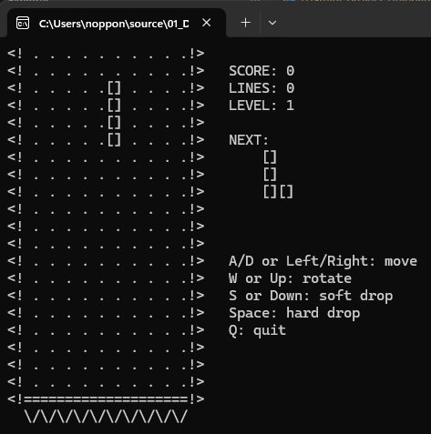
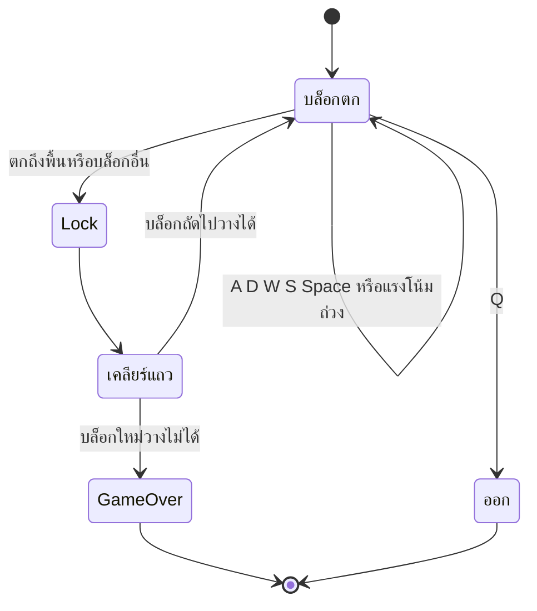

# Tetris — Game Design Document

## 🎯 Overview

| หัวข้อ                   | รายละเอียด                                                                                                                  |
| ------------------------------ | ------------------------------------------------------------------------------------------------------------------------------------- |
| ชื่อเกม                 | Tetris (Console)                                                                                                                      |
| แนว                         | Puzzle / Arcade — เล่นคนเดียว                                                                                             |
| แพลตฟอร์ม             | Windows Console (`conio.h`, `windows.h`)                                                                                          |
| ภาษา / มาตรฐาน      | C99                                                                                                                                   |
| เป้าหมายผู้เล่น | วางบล็อกให้เต็มแถวเพื่อเคลียร์ ทำคะแนนสูงสุดก่อนที่บล็อกจะกองถึงยอด |



## 🎮 วิธีเล่น

### ปุ่มควบคุม

| ปุ่ม       | การกระทำ                                                  |
| -------------- | ----------------------------------------------------------------- |
| `A` / `←` | เลื่อนซ้าย                                              |
| `D` / `→` | เลื่อนขวา                                                |
| `W` / `↑` | หมุนบล็อก 90°                                           |
| `S` / `↓` | เร่งตก 1 ช่อง (soft drop, +1 คะแนน)                |
| `Space`      | ตกลงสุดทันที (hard drop, +2 คะแนนต่อช่อง) |
| `Q`          | ออกจากเกม                                                |

### ช่วงของเกม (State Diagram)



### กติกา

| แถวที่เคลียร์พร้อมกัน | คะแนน (× level) |
| ------------------------------------------ | --------------------- |
| 1                                          | 100                   |
| 2                                          | 300                   |
| 3                                          | 500                   |
| 4                                          | 800                   |

- ทุก **10 แถว** ที่เคลียร์ → level +1 (`level = lines / 10 + 1`)
- ความเร็วตก: 800 ms − 70 ms ต่อ level (ต่ำสุด 100 ms)
- มีช่อง **NEXT** แสดงบล็อกถัดไป
- บล็อกใหม่ไม่มีที่วางที่ตำแหน่งเริ่มต้น → GAME OVER

## 🧩 องค์ประกอบในเกม

| องค์ประกอบ | จำนวน / ขนาด                                 | หมายเหตุ                                                              |
| -------------------- | ----------------------------------------------------- | ----------------------------------------------------------------------------- |
| สนาม             | 10 × 20 ช่อง (`FIELD_W` × `FIELD_H`)        | ช่องละ 2 ตัวอักษร (`[]` / ` .`)                             |
| Tetromino            | 7 แบบ                                              | เก็บเป็นสตริง 4×4 ใน `SHAPES`                               |
| การหมุน       | 4 ทิศ                                              | คำนวณ index ด้วย `rotateIndex` (ไม่เก็บ 4 ตารางแยก) |
| Side panel           | Score / Lines / Level / Next / คำแนะนำปุ่ม |                                                                               |

## 🏗️ สถาปัตยกรรม (Single-File)

อยู่ใน [main.c](main.c)

```
main ─► Game Loop (input → gravity → lock → render)
   ├► fits()         ตรวจว่าบล็อกวางที่ตำแหน่ง/ทิศนั้นได้ไหม
   ├► rotateIndex()  แปลงตำแหน่งใน 4×4 ตามทิศหมุน
   ├► lockPiece()    คัดลอกบล็อกลง field
   ├► clearLines()   ลบแถวเต็ม + คิดคะแนน/level
   └► render()       วาดทั้งเฟรมใน buffer เดียว
```

## ⚙️ ระบบที่เขียน

### 1. Game Loop (เวลาจริง)

```c
while (!gameOver && !quit) {
    // INPUT   : while (kbhit()) → ซ้าย/ขวา/หมุน/soft/hard drop
    // GRAVITY : ถ้าผ่าน interval (ตาม level) → ตก 1 ช่อง หรือ lock
    // LOCK    : lockPiece → clearLines → สร้างบล็อกใหม่ → ตรวจ game over
    // DRAW    : render() เมื่อ dirty
    Sleep(10);
}
```

ใช้ธง `dirty` — วาดใหม่เฉพาะเมื่อมีอะไรเปลี่ยน

### 2. การหมุนด้วยสูตร index

บล็อกทุกชิ้นเก็บเป็นสตริง 16 ตัวอักษร (`X` = บล็อก) ฟังก์ชัน `rotateIndex(px, py, r)` คืน index ที่ต้องอ่านตามทิศหมุน r×90° จึงเก็บข้อมูลเพียงชุดเดียว

### 3. การตรวจการชน (`fits`)

วนทุกช่องใน 4×4 ที่เป็นบล็อก — ถ้าออกนอกซ้าย/ขวา/พื้น หรือทับช่องที่ lock แล้ว → คืน 0 ผู้เรียกใช้ทดลอง "ถ้าขยับแล้วจะวางได้ไหม" ก่อนขยับจริงทุกครั้ง

### 4. การเคลียร์แถว (`clearLines`)

สแกนจากล่างขึ้นบน — แถวเต็มจะ `memcpy` แถวด้านบนทั้งหมดลงมาหนึ่งแถว แล้วตรวจแถวเดิมซ้ำ (`y++`) เพื่อรองรับแถวเต็มติดกัน

### 5. Rendering

`sprintf` ลง buffer เดียว → `fputs` ครั้งเดียว โดยใช้ `SetConsoleCursorPosition(0,0)` แทนการล้างจอ — ไม่กะพริบ

## 🧰 สรุปฟังก์ชันที่นำมาประยุกต์ใช้

### ฟังก์ชันที่เขียนเอง

| ฟังก์ชัน                 | หน้าที่                                   | Parameter / Return                         |
| -------------------------------- | ------------------------------------------------ | ------------------------------------------ |
| `rotateIndex(px, py, r)`       | แปลงพิกัดใน 4×4 ตามการหมุน | คืน index 0–15                         |
| `fits(piece, r, x, y)`         | ตรวจว่าวางได้หรือไม่         | คืน 1 = วางได้                    |
| `lockPiece(piece, r, x, y)`    | คัดลอกบล็อกลงสนาม               | `void`                                   |
| `clearLines()`                 | ลบแถวเต็ม + คิดคะแนน            | คืนจำนวนแถวที่เคลียร์ |
| `render(piece, r, x, y, next)` | วาดสนามและ side panel                  | `void`                                   |
| `hideCursor()`                 | ซ่อน cursor                                  | `void`                                   |

### ฟังก์ชันมาตรฐาน / Windows API ที่เรียกใช้

| Header        | ฟังก์ชัน                       | ใช้ทำอะไรในเกม                                              |
| ------------- | -------------------------------------- | ------------------------------------------------------------------------- |
| `stdio.h`   | `sprintf`, `fputs`, `printf`     | สร้างและพิมพ์เฟรม                                        |
| `stdlib.h`  | `rand`, `srand`, `system("cls")` | สุ่มบล็อก / ล้างจอตอนเริ่ม                         |
| `string.h`  | `memcpy`, `memset`                 | เลื่อนแถวลงเมื่อเคลียร์ / ล้างแถวบนสุด |
| `time.h`    | `time`                               | seed ของ `srand`                                                     |
| `conio.h`   | `kbhit`, `getch`                   | อ่านปุ่มแบบ non-blocking รวมปุ่มลูกศร              |
| `windows.h` | `GetTickCount`, `Sleep`            | จับเวลาแรงโน้มถ่วง / พัก CPU                         |
| `windows.h` | `SetConsoleCursorPosition` ฯลฯ    | ย้าย/ซ่อน cursor                                                  |

### แนวคิดที่นำมาใช้

| แนวคิด                                          | ตัวอย่างในโค้ด | ประโยชน์                                                |
| ----------------------------------------------------- | ---------------------------- | --------------------------------------------------------------- |
| `static const` array ของ string                  | `SHAPES[7][17]`            | เก็บรูปบล็อกเป็นข้อมูล ไม่ใช่`if` |
| Array 2 มิติเป็นสนาม                      | `field[FIELD_H][FIELD_W]`  | 0 = ว่าง, 1 = ถูก lock                                   |
| ฟังก์ชันตรวจ "ลองก่อนทำจริง" | `fits(...)`                | กันบล็อกทะลุกำแพง                              |
| Dirty flag                                            | `dirty`                    | ลดงานวาดโดยไม่จำเป็น                        |
| คณิตศาสตร์ของ index                      | `rotateIndex`              | หมุนโดยไม่เก็บซ้ำ 4 ชุด                     |
| Lookup table                                          | `points[5]`                | คิดคะแนนตามจำนวนแถว                          |
| Scan code                                             | `key == 0 \|\| key == 224`   | อ่านลูกศร                                              |

## ⚠️ ข้อจำกัดที่ทราบ

- ทำงานบน Windows เท่านั้น
- สุ่มบล็อกแบบอิสระ (`rand() % 7`) ไม่ใช่แบบ 7-bag ผู้เล่นอาจเจอบล็อกชนิดเดิมซ้ำ ๆ
- หมุนไม่มี wall kick — ถ้าชิดกำแพงแล้วหมุนไม่ได้ ตัวบล็อกจะไม่หมุน
- ไม่มีสี, ไม่มี ghost piece, ไม่มี hold
- Game Over แล้วโปรแกรมจบเลย ไม่มีเล่นใหม่และไม่เก็บ high score

## 🔧 Compile & Run

```bash
gcc -std=c99 -Wall main.c -o main
./main
```

## 💡 แนวทางต่อยอด (แบบฝึกหัด)

1. เพิ่มสีต่างกันตามชนิดบล็อก (`SetConsoleTextAttribute`)
2. ทำ ghost piece แสดงตำแหน่งที่บล็อกจะตกลง
3. สุ่มแบบ 7-bag
4. บันทึก high score ลงไฟล์ (Week 11: File I/O)
5. เพิ่มปุ่ม Pause และปุ่มเล่นใหม่
6. แยก logic ออกจาก render เป็นหลายไฟล์ แล้วย้ายไป Raylib
