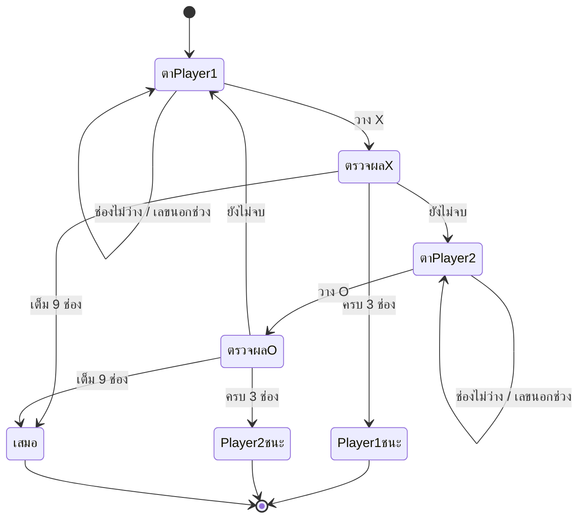

# Tic-Tac-Toe — Game Design Document

## 🎯 Overview

| หัวข้อ | รายละเอียด |
|--------|-----------|
| ชื่อเกม | Tic-Tac-Toe (Console) |
| แนว | Board game — 2 ผู้เล่น (สลับกันเล่นเครื่องเดียว) |
| แพลตฟอร์ม | Windows Console (`conio.h`, `system("cls")`) |
| ภาษา / มาตรฐาน | C99 (ใช้ `scanf_s`) |
| เป้าหมายผู้เล่น | วางเครื่องหมายของตนให้ครบ 3 ช่องติดกันก่อนอีกฝ่าย |

> ดัดแปลงจาก [R3DHULK/C-For-Gamers](https://github.com/R3DHULK/C-For-Gamers/blob/main/tic-tac-toe.c) โดยปรับให้ใช้ pointer / array 2 มิติเป็นตัวอย่างการสอน

## 🎮 วิธีเล่น

### การควบคุม

ป้อนหมายเลขช่อง `1`–`9` แล้วกด `Enter` — เลขช่องเรียงแบบ **numpad**

```
 7 | 8 | 9
---+---+---
 4 | 5 | 6
---+---+---
 1 | 2 | 3
```

ถ้าเลือกช่องที่ไม่ว่างหรือเลขนอกช่วง เกมจะถามใหม่จนกว่าจะได้ช่องที่ถูกต้อง

### ช่วงของเกม (State Diagram)



### กติกา

- Player 1 ใช้ `X` เดินก่อน, Player 2 ใช้ `O`
- ชนะเมื่อมี 3 ช่องติดกันเป็นแถว คอลัมน์ หรือแนวทแยง (รวม 8 เส้น)
- วางครบ 9 ช่องโดยไม่มีผู้ชนะ → เสมอ
- เล่นได้รอบเดียวต่อการรันโปรแกรม

## 🧩 องค์ประกอบในเกม

| องค์ประกอบ | จำนวน / ขนาด | หมายเหตุ |
|-----------|-------------|---------|
| กระดาน | 3 × 3 (`BOARD_SIZE`) | `char board[3][3]` ช่องว่างคือ `' '` |
| เส้นชนะ | 8 เส้น | เก็บเป็นตาราง `LINES[8][3][2]` ของพิกัด {row, col} |
| ผู้เล่น | 2 | `X` และ `O` |

## 🏗️ สถาปัตยกรรม (Single-File)

อยู่ใน [main.c](main.c) — แยกฟังก์ชันตามหน้าที่

```
main ─► show_screen() ─► print_board()
     ├► get_move()       รับตำแหน่ง → แปลงเป็น row/col
     ├► check_win() ─► line_wins()   ตรวจทีละเส้นผ่าน pointer
     └► init_board()
```

## ⚙️ ระบบที่เขียน

### 1. Game Loop (turn-based)

วนต่อไปนี้ทุกตา: วาดหน้าจอ → รับตำแหน่ง → วางเครื่องหมาย → ตรวจชนะ → ตรวจเสมอ → สลับผู้เล่น

### 2. การแปลงเลข numpad เป็นพิกัด

```c
*row = BOARD_SIZE - 1 - (pos - 1) / BOARD_SIZE;
*col = (pos - 1) % BOARD_SIZE;
```

### 3. การตรวจผู้ชนะแบบข้อมูลขับเคลื่อน (data-driven)

แทนที่จะเขียน `if` ยาว ๆ 8 บรรทัด ใช้ตาราง `LINES` แล้ววน 8 รอบเรียก `line_wins(&a, &b, &c, symbol)` ซึ่งรับ **pointer ไปยัง 3 ช่อง** และเทียบกับเครื่องหมาย

### 4. การเดินของ array 2 มิติด้วย pointer

`init_board` ใช้ `char *cell = &board[0][0]` เดินผ่านทั้ง 9 ช่องเป็น array 1 มิติ

## 🧰 สรุปฟังก์ชันที่นำมาประยุกต์ใช้

### ฟังก์ชันที่เขียนเอง

| ฟังก์ชัน | หน้าที่ | Parameter / Return |
|---------|--------|--------------------|
| `init_board(board)` | เติมช่องว่างทั้งกระดาน | array 2 มิติ / `void` |
| `print_board(board)` | วาดกระดาน | `const` array / `void` |
| `show_screen(board)` | ล้างจอ + คู่มือเลขช่อง + กระดาน | `const` array / `void` |
| `get_move(board, &row, &col)` | รับตำแหน่งจนกว่าจะถูกต้อง | ส่งผลออกทาง pointer / `void` |
| `line_wins(a, b, c, symbol)` | เทียบ 3 ช่องกับ symbol | `const char*` ×3 / คืน 0 หรือ 1 |
| `check_win(board, symbol)` | ตรวจครบ 8 เส้น | คืน 1 ถ้าชนะ |

### ฟังก์ชันมาตรฐานที่เรียกใช้

| Header | ฟังก์ชัน | ใช้ทำอะไรในเกม |
|--------|---------|----------------|
| `stdio.h` | `printf`, `scanf_s` | วาดกระดาน / รับเลขช่อง |
| `stdlib.h` | `system("cls")` | ล้างหน้าจอทุกตา |
| `conio.h` | `getch` | รอกดปุ่มก่อนปิด |

### แนวคิดการเขียนฟังก์ชันที่นำมาใช้

| แนวคิด | ตัวอย่างในโค้ด | ประโยชน์ |
|--------|---------------|---------|
| Array 2 มิติเป็นพารามิเตอร์ | `char board[BOARD_SIZE][BOARD_SIZE]` | ส่งกระดานเข้าฟังก์ชันได้ |
| `const` | `print_board(const char ...)` | กันฟังก์ชันวาดแก้กระดาน |
| Output parameter | `get_move(..., int *row, int *col)` | คืนค่าได้มากกว่า 1 ค่า |
| Pointer arithmetic / address-of | `&board[r][c]`, `cell[i]` | เข้าถึงช่องด้วยที่อยู่ |
| ตารางข้อมูลแทนโค้ดซ้ำ | `LINES[8][3][2]` | เพิ่ม/แก้กฎง่ายและโค้ดสั้นลง |
| `#define` ค่าคงที่ | `BOARD_SIZE` | ปรับขนาดที่เดียว |

## ⚠️ ข้อจำกัดที่ทราบ

- ทำงานบน Windows เท่านั้น
- ไม่มีโหมดเล่นกับคอมพิวเตอร์ (ต้องมีผู้เล่น 2 คน)
- ไม่มีเล่นซ้ำ / นับคะแนนหลายเกม
- ตาราง `LINES` และ `check_win` ผูกกับกระดาน 3×3 เท่านั้น แม้จะมี `BOARD_SIZE`
- ป้อนตัวอักษรแทนตัวเลขอาจทำให้ `get_move` วนไม่จบ (ไม่ได้ตรวจค่าที่ `scanf_s` คืน)

## 🔧 Compile & Run

```bash
gcc -std=c99 -Wall main.c -o main
./main
```

## 💡 แนวทางต่อยอด (แบบฝึกหัด)

1. เพิ่มโหมดเล่นกับคอมพิวเตอร์ (สุ่ม → ปิดกั้น/ชนะ → minimax)
2. เล่นซ้ำและนับคะแนนสะสม
3. ไฮไลต์ 3 ช่องที่ชนะด้วยสี
4. ตรวจค่าที่ `scanf_s` คืนเพื่อกัน input ผิดชนิด
5. ขยายเป็นกระดาน 4×4 หรือ 5×5 (ต้องปรับ `LINES`)
