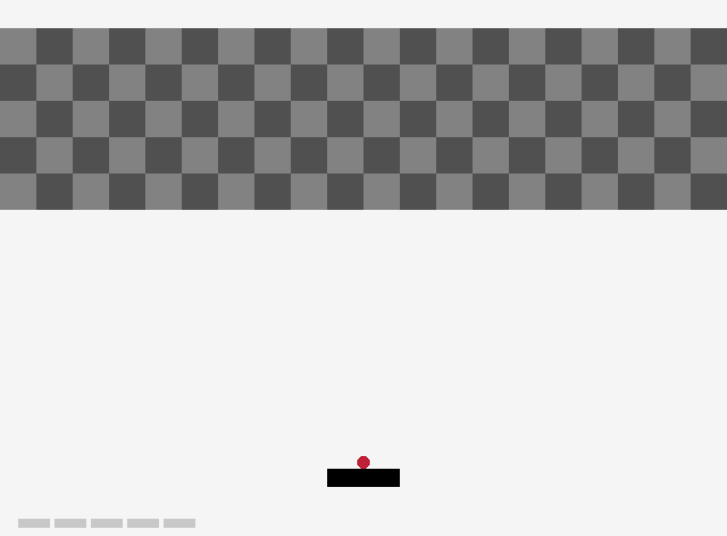

# arkanoid — Arkanoid: เกมตีบล็อก

เลื่อนแท่นด้านล่างรับลูกบอลให้เด้งไปชนบล็อกทั้งหมดให้หมดโดยไม่ให้ลูกตกพื้น (~315 บรรทัด)

sample จาก raylib โดย Marc Palau และ Ramon Santamaria (zlib/libpng) — ดูรายการเกมทั้งหมดที่ [README ของโฟลเดอร์ src](../README.md)



## 📜 กติกา

- เริ่มเกมด้วย **5 ชีวิต** ลูกบอลจะติดอยู่บนแท่นจนกว่าจะกด `Space`
- ลูกบอลชนบล็อก → บล็อกหายไป ลูกบอลสะท้อนกลับ
- ลูกบอลตกขอบล่างจอ → เสีย 1 ชีวิต ลูกบอลกลับมาติดแท่นรอปล่อยใหม่
- **ชนะ** เมื่อบล็อกทั้งหมดหาย · **แพ้** เมื่อชีวิตเหลือ 0 (ทั้งสองกรณีขึ้นข้อความ `PRESS [ENTER] TO PLAY AGAIN`)
- ทิศที่ลูกเด้งออกจากแท่นขึ้นกับ **จุดที่ลูกชนแท่น**: ชนตรงกลางเด้งขึ้นตรง ๆ ชนใกล้ขอบเด้งเฉียงมากขึ้น

## 🎮 ปุ่มควบคุม

| ปุ่ม        | การกระทำ                                              |
| --------------- | ------------------------------------------------------------- |
| `←` / `→` | เลื่อนแท่น (5 px ต่อ frame)                      |
| `Space`       | ปล่อยลูกบอล (เฉพาะตอนลูกติดแท่น) |
| `P`           | หยุด / เล่นต่อ                                     |
| `Enter`       | เริ่มใหม่ (หลังจบเกม)                       |

## ⚙️ ค่าคงที่และข้อมูลหลัก

| รายการ     | ค่า                                               | หมายเหตุ                                        |
| ---------------- | ---------------------------------------------------- | ------------------------------------------------------- |
| หน้าต่าง | 800 × 600                                           | 60 FPS                                                  |
| ชีวิต       | `PLAYER_MAX_LIFE` = 5                              | วาดเป็นแถบเล็กมุมล่างซ้าย      |
| บล็อก       | `LINES_OF_BRICKS` × `BRICKS_PER_LINE` = 5 × 20 | ขนาด 40 × 40 px, สลับสีเทา/เทาเข้ม |
| แท่น         | กว้าง 1/10 ของจอ (80 px), สูง 20 px     | อยู่ที่ระดับ 7/8 ของความสูงจอ   |
| ลูกบอล     | รัศมี 7 px                                      | ความเร็วเริ่มต้น `(0, -5)`            |

## 🧩 โครงสร้างโค้ด

- `Player` (ตำแหน่ง ขนาด ชีวิต), `Ball` (ตำแหน่ง ความเร็ว รัศมี `active`), `Brick` (ตำแหน่ง `active`)
- บล็อกเก็บเป็น **array 2 มิติ** `brick[5][20]` — ลบบล็อกด้วยการตั้ง `active = false` ไม่ต้อง free อะไร
- `InitGame()` ตั้งค่าทุกอย่างใหม่ → ใช้ซ้ำตอนกด `Enter` เพื่อเริ่มเกมใหม่
- `UpdateGame()` เรียงลำดับ: อ่านปุ่ม → เคลื่อนที่ → ชนกำแพง → ชนแท่น → ชนบล็อก → ตรวจแพ้/ชนะ

## 🔍 ประเด็นที่น่าศึกษา

- **สูตรมุมสะท้อน:** `ball.speed.x = (ball.x - player.x) / (player.width/2) * 5` — ยิ่งชนห่างจากกลางแท่น ความเร็วแนวนอนยิ่งมาก
- **ชนบล็อก 4 ทิศ:** ตรวจว่าลูกบอล "เพิ่งข้าม" ขอบบน/ล่าง/ซ้าย/ขวาของบล็อกใน frame นี้ แล้วกลับทิศแกนที่ตรงกัน (ไม่ใช้ `CheckCollisionCircleRec` กับบล็อก)
- **ไม่ใช้ delta time:** เคลื่อนที่เป็น px ต่อ frame ตายตัว — ถ้า FPS เปลี่ยนความเร็วเกมก็เปลี่ยน (ต่างจาก convention ของวิชาที่ใช้ `x += speed * dt`)
- ความเร็วลูกบอลไม่เพิ่มตามเวลา

## ✏️ โจทย์ต่อยอด

1. เพิ่มคะแนนและแสดงบนหน้าจอ
2. ให้ลูกบอลเร็วขึ้นทุกครั้งที่ชนแท่น
3. เพิ่มบล็อกที่ต้องชน 2 ครั้ง (เปลี่ยน `bool active` เป็น `int hp`)
4. แก้ให้เคลื่อนที่ด้วย delta time

## 🔨 Compile

```bash
gcc -std=c99 main.c -o arkanoid -lraylib -lm -lwinmm -lgdi32
```
