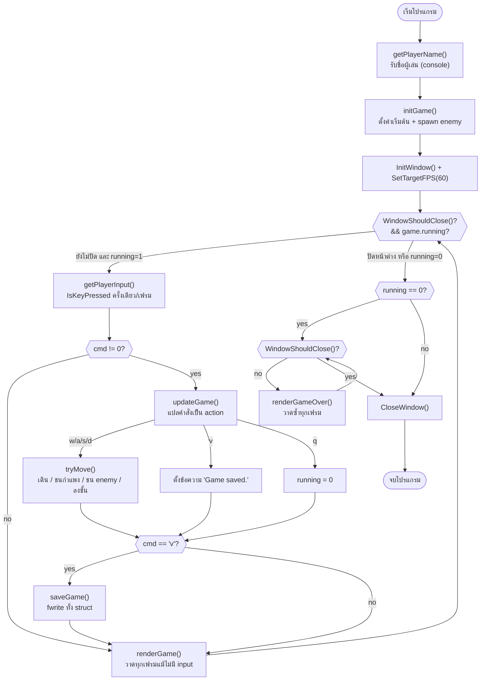
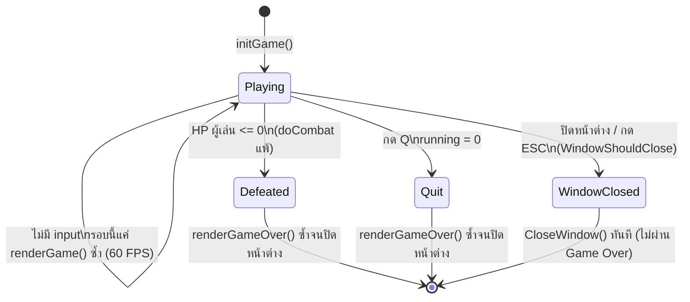

# Week 13 — Single-File Raylib Example (Dungeon Explorer)

เกมเดียวกับ [Week 12 (dungeon.c)](../../../week_12/src/dungeon_single_file/README.md) แต่เปลี่ยน "render" และ "input" จาก printf/conio.h เป็น Raylib — struct และ game logic (setup/logic) ทุกฟังก์ชันเหมือนเดิมทุกบรรทัด ตามที่ Week 12 บอกไว้ว่า "Week 13 เปลี่ยนแค่ render/input ส่วน game logic ไม่ต้องแตะ"

## ▶️ Compile & Run

```bash
gcc -std=c99 -Wall dungeon_raylib.c -o dungeon_raylib -lraylib -lopengl32 -lgdi32 -lwinmm
./dungeon_raylib
```

## 🎮 วิธีเล่น

พิมพ์ชื่อผู้เล่นในหน้าต่าง console ก่อน (กด Enter) จากนั้นหน้าต่าง Raylib จะเปิดขึ้น — W/A/S/D หรือปุ่มลูกศร เดิน (กดปุ๊บขยับปั๊บ ไม่ต้องกด Enter, ชนสี่เหลี่ยมสีแดง = ต่อสู้อัตโนมัติ, ถึงช่องสีทอง = ลงชั้นถัดไป), V บันทึกเกม, Q ออก (ESC ปิดหน้าต่างได้เช่นกัน) — บันทึก `dungeon_save.bin` เฉพาะตอนกด V เท่านั้น (ไม่ auto-save)

## 📚 ฟังก์ชัน Standard C99 ที่ใช้

| Header | ฟังก์ชัน | ใช้ทำอะไรในเกมนี้ |
|--------|----------|---------------------|
| `stdio.h` | `printf` | ข้อความต้อนรับใน console ก่อนเปิดหน้าต่าง |
| `stdio.h` | `scanf` | รับชื่อผู้เล่นตอนเริ่มเกม (`getPlayerName`) |
| `stdio.h` | `snprintf` | สร้างข้อความ enemy/message แบบจำกัดความยาว กัน buffer overflow |
| `stdio.h` | `fopen` / `fclose` | เปิด/ปิดไฟล์ save (`dungeon_save.bin`) |
| `stdio.h` | `fwrite` / `fread` | เขียน/อ่าน `GameState` ทั้งก้อนแบบ binary |
| `stdlib.h` | `srand` | สุ่ม seed ตอนเริ่มเกม (ใช้คู่กับ `time`) |
| `string.h` | `memset` | เคลียร์ `GameState` ทั้งก้อนเป็น 0 ตอน `initGame` |
| `string.h` | `strncpy` / `strcpy` | คัดลอกชื่อผู้เล่น/ข้อความลง struct |
| `time.h` | `time` | เวลาปัจจุบัน ใช้เป็น seed ให้ `srand` |

> เทียบกับ Week 12: **ไม่มี** `system("cls")` และ **ไม่มี** `conio.h` (`getch`) อีกต่อไป — ถูกแทนที่ด้วย Raylib ทั้งคู่

## 🎮 ฟังก์ชัน Raylib API ที่ใช้

| ฟังก์ชัน | ใช้ทำอะไรในเกมนี้ |
|----------|---------------------|
| `InitWindow` / `CloseWindow` | เปิด/ปิดหน้าต่างเกม |
| `SetTargetFPS` | ล็อกเกมไว้ที่ 60 FPS |
| `WindowShouldClose` | เงื่อนไข while loop หลัก (กด ESC หรือปิดหน้าต่าง) |
| `BeginDrawing` / `EndDrawing` | ขอบเขตของ 1 เฟรม — วาดทุกอย่างระหว่างนี้ |
| `ClearBackground` | ล้างจอ **แทน** `system("cls")` — ต้องเรียกทุกเฟรม |
| `DrawRectangle` / `DrawRectangleLines` | วาด tile, player, enemy, กรอบ HP bar |
| `DrawText` / `TextFormat` | วาดข้อความ HUD (ชื่อ, Lv, Floor, message) |
| `IsKeyPressed` | เช็คว่าคีย์ถูกกด **ครั้งเดียว** ในเฟรมนี้ — **แทน** `getch()` |

## 🛠️ ฟังก์ชันที่พัฒนาขึ้นเอง

| กลุ่ม | ฟังก์ชัน | หน้าที่ | เปลี่ยนจาก Week 12 หรือไม่ |
|-------|----------|---------|------------------------------|
| Setup | `generateEnemy(Enemy*, int floor)` | สุ่มค่า hp/attack ของ enemy ตาม floor ปัจจุบัน | ไม่เปลี่ยน |
| Setup | `spawnFloorEnemies(GameState*)` | เติม enemy pool ทุกครั้งที่ขึ้นชั้นใหม่ (reuse slot เดิม) | ไม่เปลี่ยน |
| Setup | `initGame(GameState*, const char* name)` | ตั้งค่าเริ่มต้นทั้งหมดของเกม | ไม่เปลี่ยน |
| Logic | `doCombat(GameState*, Enemy*)` | ต่อสู้อัตโนมัติจนฝ่ายใดฝ่ายหนึ่งตาย | ไม่เปลี่ยน |
| Logic | `walkEnemies(GameState*)` | ให้ enemy ที่ active เดินเข้าหาผู้เล่น 1 ช่อง/turn | ไม่เปลี่ยน |
| Logic | `checkCollisions(GameState*)` | เช็คว่าผู้เล่นเดินทับ enemy หรือไม่ → เข้าสู้ | ไม่เปลี่ยน |
| Logic | `tryMove(GameState*, int dRow, int dCol)` | ขยับผู้เล่น + ชนกำแพง + ชน enemy + ลงชั้น | ไม่เปลี่ยน |
| Logic | `updateGame(GameState*, char cmd)` | แปลคำสั่งผู้เล่น (w/a/s/d/v/q) เป็น action | ไม่เปลี่ยน |
| Render | `drawHpBar(int cur, int max, int x, int y, int w, int h)` | วาด HP bar ด้วย `DrawRectangle` (เดิมคือ `printBar` แบบ `[####  ]`) | **เปลี่ยน** (Raylib) |
| Render | `drawMap(const GameState*)` | วาด tilemap + player + enemy เป็นสี่เหลี่ยมสี | **เปลี่ยน** (Raylib) |
| Render | `renderGame(const GameState*)` | `BeginDrawing`/`EndDrawing` + วาด map/HUD ทั้งเฟรม | **เปลี่ยน** (Raylib) |
| Render | `renderGameOver(const GameState*)` | วาดหน้าจอสรุปผลตอนจบเกม (วาดซ้ำทุกเฟรมจนปิดหน้าต่าง) | **เปลี่ยน** (Raylib) |
| Input | `getPlayerName(char* name)` | รับชื่อผู้เล่นตอนเริ่ม (console, ต้องกด Enter) | ไม่เปลี่ยน |
| Input | `getPlayerInput(void)` | เช็ค `IsKeyPressed` แทน `getch()` แต่ยังคืน char ตัวเดียวแบบเดิม | **เปลี่ยน** (Raylib) |
| Save | `saveGame(const GameState*, const char* filename)` | เขียน `GameState` ทั้งก้อนลงไฟล์ binary | ไม่เปลี่ยน |
| Save | `loadGame(GameState*, const char* filename)` | อ่าน `GameState` กลับจากไฟล์ binary | ไม่เปลี่ยน |
| Entry | `main(void)` | เปิดหน้าต่าง Raylib + game loop 60 FPS | **เปลี่ยน** (Raylib) |

## 🔄 Program Flow



> **ต่างจาก Week 12 ตรงไหน:** เวอร์ชัน terminal วาดจอแค่ตอนมี input ใหม่เท่านั้น (blocking loop) ส่วนเวอร์ชัน Raylib ต้องวาดทุกเฟรม (60 FPS) แม้ผู้เล่นยังไม่กดอะไร เพราะหน้าต่าง GUI ต้อง responsive ตลอดเวลา — นี่คือความต่างหลักระหว่าง turn-based loop กับ real-time loop ตามที่สอนใน slide "Terminal vs Raylib Game Loop"

## 🗂️ GameState — State Diagram



- **Playing** (`running = 1`) — วนอยู่ใน game loop 60 FPS, HP ผู้เล่น > 0
- **Defeated** — แพ้ต่อสู้ (`doCombat` ลด `player.hp` จนเหลือ 0) → `running = 0`
- **Quit** — ผู้เล่นกด Q → `running = 0` ทันที (ไม่ต้องรอ HP หมด)
- **WindowClosed** — ปิดหน้าต่างหรือกด ESC ระหว่างเล่น → ออกจากโปรแกรมทันที ไม่ผ่านหน้า Game Over (state ที่ไม่มีในเวอร์ชัน terminal เพราะ terminal ไม่มี "หน้าต่าง" ให้ปิด)
- Defeated/Quit วาด `renderGameOver()` ซ้ำทุกเฟรมจนกว่าผู้เล่นจะปิดหน้าต่างเอง — ต่างจาก Week 12 ที่ `printf` ครั้งเดียวแล้วจบโปรแกรมทันที
