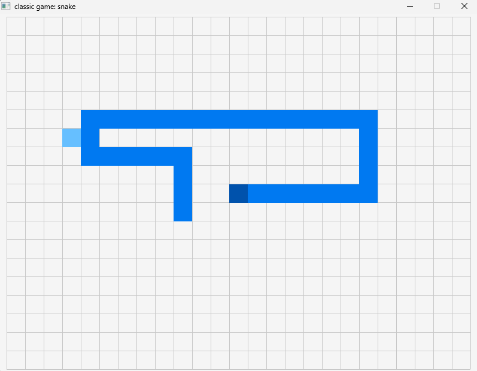

# snake — Snake: งูกินผลไม้

บังคับงูบนตารางให้กินผลไม้จนตัวยาวขึ้น โดยห้ามชนขอบจอหรือชนตัวเอง (~285 บรรทัด)

sample จาก raylib โดย Ian Eito, Albert Martos และ Ramon Santamaria (zlib/libpng) — ดูรายการเกมทั้งหมดที่ [README ของโฟลเดอร์ src](../README.md)



## 📜 กติกา

- งูเริ่มจากมุมซ้ายบน ยาว 1 ช่อง หันไปทางขวา
- ผลไม้ (สี่เหลี่ยมสีฟ้าอ่อน) ปรากฏที่ช่องสุ่มที่ไม่ทับตัวงู
- หัวงูชนผลไม้ → ตัวยาวขึ้น 1 ช่อง แล้วสุ่มผลไม้ใหม่
- **แพ้** เมื่อหัวชนขอบจอ หรือชนตัวเอง → ขึ้น `PRESS [ENTER] TO PLAY AGAIN`
- **ไม่มีระบบคะแนน** — วัดผลจากความยาวงูเท่านั้น
- หันกลับหลัง 180° ไม่ได้ (เช่น กำลังไปขวาจะกด `←` ไม่ได้)

## 🎮 ปุ่มควบคุม

| ปุ่ม                    | การกระทำ                                                        |
| --------------------------- | ----------------------------------------------------------------------- |
| `↑` `↓` `←` `→` | เลี้ยวงู (รับได้ 1 ครั้งต่อ 1 ก้าวของงู) |
| `P`                       | หยุด / เล่นต่อ                                               |
| `Enter`                   | เริ่มใหม่ (หลังจบเกม)                                 |

## ⚙️ ค่าคงที่และข้อมูลหลัก

| รายการ               | ค่า                                                 | หมายเหตุ                                                                                                                                          |
| -------------------------- | ------------------------------------------------------ | --------------------------------------------------------------------------------------------------------------------------------------------------------- |
| หน้าต่าง           | 800 × 600                                             | 60 FPS                                                                                                                                                    |
| ขนาดช่อง           | `SQUARE_SIZE` = 31 px                                | ตาราง 25 × 19 ช่อง มี`offset` เพื่อจัดกริดให้อยู่กึ่งกลาง (เพราะ 800 และ 600 หาร 31 ไม่ลงตัว) |
| ความยาวสูงสุด | `SNAKE_LENGTH` = 256 ปล้อง                      | array ขนาดคงที่                                                                                                                                  |
| ความเร็ว           | งูเดินทุก 5 frame ≈ 12 ก้าว/วินาที | ไม่เร็วขึ้นตามความยาว                                                                                                                |

## 🧩 โครงสร้างโค้ด

- `Snake` (ตำแหน่ง ขนาด ความเร็ว สี) และ `Food` (ตำแหน่ง ขนาด `active` สี)
- `snake[256]` เก็บทุกปล้อง · `counterTail` = จำนวนปล้องที่ใช้อยู่ · `snakePosition[256]` เก็บ "ตำแหน่งก่อนขยับ" ของแต่ละปล้อง
- **หลักการเดินของงู:** ทุก 5 frame หัวขยับตามความเร็ว แล้วปล้องอื่นย้ายไปยังตำแหน่งเดิมของปล้องหน้ามัน (`snake[i].position = snakePosition[i-1]`)
- `allowMove` กันไม่ให้เลี้ยวซ้อนหลายครั้งภายในก้าวเดียว (ซึ่งจะทำให้หันกลับหลังชนตัวเองได้)
- `framesCounter % 5` ใช้แทนตัวจับเวลา — เป็นการคุมจังหวะเกมแบบ **fixed step**

## 🔍 ประเด็นที่น่าศึกษา / ข้อจำกัดที่พบ

- **Array + shift ตำแหน่ง:** ตัวอย่างการใช้ array เก็บประวัติตำแหน่ง (เชื่อมกับ Arrays Week 9)
- **ตัวงูยาวเกิน 256 ปล้องไม่ได้ป้องกัน:** ถ้ากินครบเกิน 255 ผล `snake[counterTail]` จะเขียนเกิน array (ในทางปฏิบัติแทบไม่มีใครเล่นถึง)
- การสุ่มผลไม้ใช้ลูป `while` ที่รีเซ็ต `i = 0` เพื่อเช็กใหม่ทั้งตัว — เข้าใจยากเล็กน้อย แต่ถูกต้อง
- ไม่ใช้ delta time (ก้าวตาม frame)

## ✏️ โจทย์ต่อยอด

1. เพิ่มคะแนนและ HI-SCORE บนหน้าจอ
2. ให้งูเร็วขึ้นเมื่อยาวขึ้น (เปลี่ยน `5` ใน `framesCounter%5` เป็นตัวแปร)
3. ทะลุขอบจอไปโผล่อีกด้านแทนการแพ้ (wrap-around)
4. เพิ่มกำแพงหรืออุปสรรคกลางกระดาน
5. รองรับปุ่ม `W A S D`

## 🔨 Compile

```bash
gcc -std=c99 main.c -o snake -lraylib -lm -lwinmm -lgdi32
```
