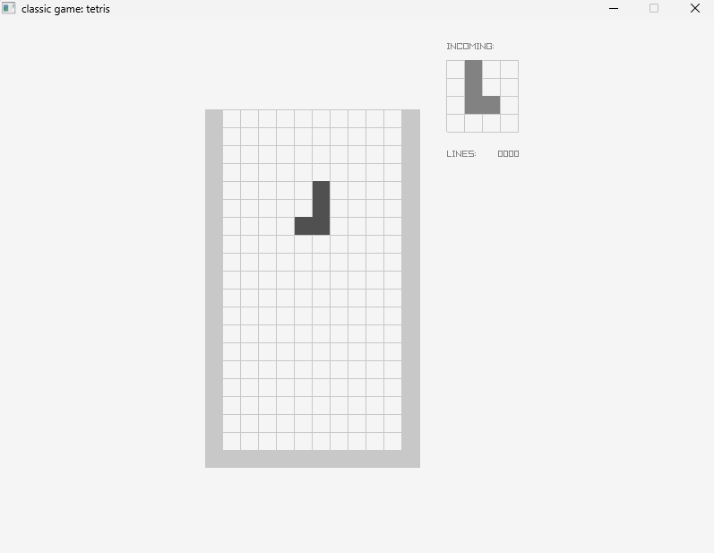

# tetris — Tetris: ต่อบล็อกให้เต็มแถว

ควบคุมบล็อกที่ตกลงมาให้ต่อกันจนเต็มแถวแล้วหายไป ห้ามให้กองบล็อกสูงถึงขอบบน (~800 บรรทัด — ยาวที่สุดในชุดนี้ เพราะเก็บตรรกะการหมุนแบบเขียนเงื่อนไขทีละกรณี)

sample จาก raylib โดย Marc Palau และ Ramon Santamaria (zlib/libpng) — ดูรายการเกมทั้งหมดที่ [README ของโฟลเดอร์ src](../README.md)



## 📜 กติกา

- กระดานกว้าง 10 × สูง 19 ช่อง (ตาราง `12 × 20` รวมกำแพงซ้าย/ขวา/พื้น)
- บล็อกตกลงมาทีละชิ้น มี **7 แบบ** สุ่มด้วย `GetRandomValue(0, 6)`:

| ชิ้น     | รูปร่าง                            |
| ------------ | ----------------------------------------- |
| Cube         | สี่เหลี่ยมจัตุรัส 2 × 2 |
| L            | ตัว L                                  |
| L inversa    | ตัว L กลับด้าน (J)             |
| Recta        | แท่งตรง 4 ช่อง (I)             |
| Creu tallada | ตัว T                                  |
| S            | ตัว S                                  |
| S inversa    | ตัว S กลับด้าน (Z)             |

- แถวไหนเต็ม → กะพริบสลับสีประมาณ 0.5 วินาที (33 frame) แล้วหายไป แถวด้านบนเลื่อนลงมาแทน
- มีช่อง **INCOMING** ด้านขวาแสดงบล็อกชิ้นถัดไป และแสดงจำนวน **LINES** ที่ลบได้
- **แพ้** เมื่อมีบล็อกที่วางลงแล้วค้างอยู่ใน 2 แถวบนสุด → ขึ้น `PRESS [ENTER] TO PLAY AGAIN`
- **ไม่มีระบบคะแนนและไม่มีระดับความเร็ว** — ตัวแปร `level` เป็น 1 ตลอด

## 🎮 ปุ่มควบคุม

| ปุ่ม              | การกระทำ                                                                        |
| --------------------- | --------------------------------------------------------------------------------------- |
| `←` / `→`       | เลื่อนซ้าย/ขวา (กดค้างเลื่อนต่อเนื่องทุก 10 frame) |
| `↑`                | หมุนบล็อก (กดค้างหมุนซ้ำทุก 12 frame)                          |
| `↓` (กดค้าง) | ตกเร็ว — ใช้ได้หลังบล็อกเกิดมาแล้ว 30 frame             |
| `P`                 | หยุด / เล่นต่อ                                                               |
| `Enter`             | เริ่มใหม่ (หลังจบเกม)                                                 |

## ⚙️ ค่าคงที่และข้อมูลหลัก

| รายการ                 | ค่า                                                                  | หมายเหตุ                                 |
| ---------------------------- | ----------------------------------------------------------------------- | ------------------------------------------------ |
| หน้าต่าง             | 800 × 600                                                              | 60 FPS                                           |
| ขนาดช่อง             | `SQUARE_SIZE` = 20 px                                                 |                                                  |
| ตาราง                   | `GRID_HORIZONTAL_SIZE` 12 × `GRID_VERTICAL_SIZE` 20                | รวมกำแพง                                 |
| ความเร็วตกปกติ | `gravitySpeed` = 30 frame ต่อ 1 ช่อง (2 ช่อง/วินาที) | คงที่ตลอดเกม                         |
| ตกเร็ว                 | รอ `FAST_FALL_AWAIT_COUNTER` = 30 frame                             | กันกดค้างจากชิ้นก่อนหน้า |
| เลื่อน/หมุน        | `LATERAL_SPEED` = 10, `TURNING_SPEED` = 12 frame                    | ตัวนับหน่วงการกดค้าง         |
| เอฟเฟกต์ลบแถว   | `FADING_TIME` = 33 frame                                              |                                                  |

## 🧩 โครงสร้างโค้ด

- `enum GridSquare { EMPTY, MOVING, FULL, BLOCK, FADING }` — **สถานะของแต่ละช่อง** ในตาราง `grid[12][20]`: ว่าง / ชิ้นที่กำลังตก / บล็อกที่วางแล้ว / กำแพง / แถวที่กำลังหายไป
- `piece[4][4]` คือชิ้นที่กำลังตก, `incomingPiece[4][4]` คือชิ้นถัดไป — เก็บเป็นเมทริกซ์ 4 × 4 แล้ว "ประทับ" ลง `grid` ที่ตำแหน่ง `piecePositionX/Y`
- ฟังก์ชันช่วย: `Createpiece`, `GetRandompiece`, `ResolveFallingMovement`, `ResolveLateralMovement`, `ResolveTurnMovement`, `CheckDetection`, `CheckCompletion`, `DeleteCompleteLines` — แต่ละอันทำหน้าที่เดียว
- **ตัวนับ frame** (`gravityMovementCounter`, `lateralMovementCounter`, `turnMovementCounter`, `fadeLineCounter`) ใช้คุมจังหวะแทนตัวจับเวลา
- ลำดับใน `UpdateGame()`: ถ้ากำลังเล่นบล็อก → นับเวลา อ่านปุ่ม ตกตามแรงโน้มถ่วง เลื่อน หมุน → ตรวจแพ้; ถ้ากำลังเอฟเฟกต์ลบแถว → หยุดรับปุ่มจนกว่าจะเล่นจบ

## 🔍 ประเด็นที่น่าศึกษา / ข้อจำกัดที่พบ

- **Array 2 มิติเป็นหัวใจของเกม:** ทั้งกระดานและชิ้นบล็อกเป็น array 2 มิติ (เชื่อมกับ Arrays Week 9) เหมาะเป็นโจทย์ให้ไล่ดูการเปลี่ยนค่าในช่อง
- **การหมุนเขียนแบบเจาะจงทีละกรณี:** `ResolveTurnMovement` และ `CheckDetection` ใช้เงื่อนไข `if` ยาว ๆ ตรวจทีละตำแหน่ง แทนการหมุนเมทริกซ์ด้วยสูตรทั่วไป อ่านยากแต่เห็นตรรกะชัดเจน — เป็นโอกาสให้นักศึกษาลองเขียนใหม่ให้สั้นลง
- **ตัวแปรที่ประกาศแต่ไม่ได้ใช้ประโยชน์:** `level` ไม่เพิ่ม ทำให้เกมไม่ยากขึ้นเมื่อเล่นนาน
- **ไม่มีการตก "ทันที" (hard drop)** และไม่มีระบบ hold
- ใช้การนับ frame ไม่ใช่ delta time

## ✏️ โจทย์ต่อยอด

1. เพิ่มระบบคะแนน (ลบ 1/2/3/4 แถวพร้อมกันได้คะแนนไม่เท่ากัน)
2. ให้ `level` เพิ่มทุก 10 แถว แล้วลดค่า `gravitySpeed` ให้บล็อกตกเร็วขึ้น
3. เพิ่มปุ่ม `Space` สำหรับ hard drop
4. ให้แต่ละชิ้นมีสีต่างกัน (เพิ่มชนิด `GridSquare` หรือเก็บสีคู่ขนาน)
5. เขียนการหมุนใหม่ด้วยสูตรหมุนเมทริกซ์ 4 × 4

## 🔨 Compile

```bash
gcc -std=c99 main.c -o tetris -lraylib -lm -lwinmm -lgdi32
```
