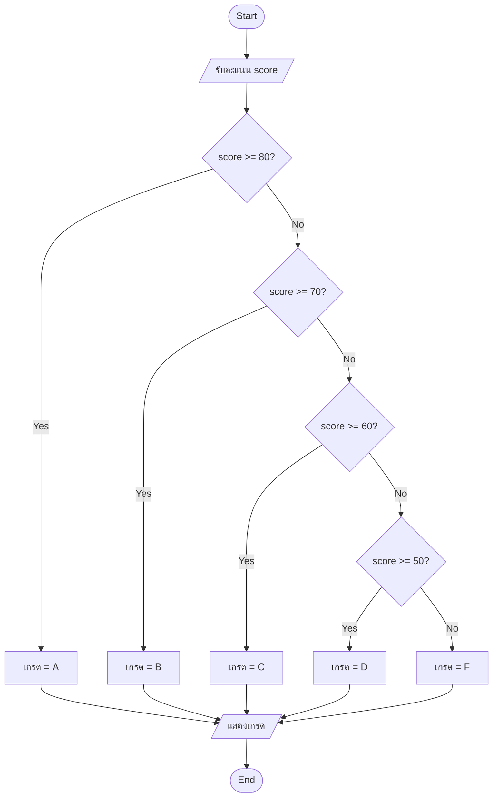
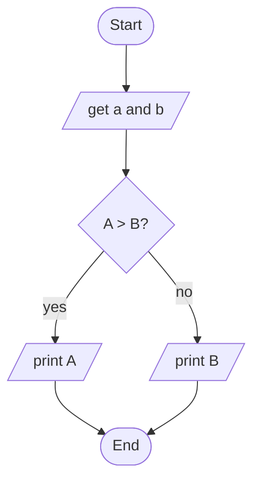
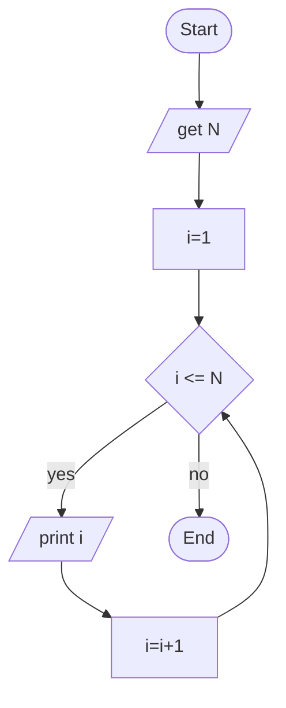

```mermaid
flowchart TD
Start([Start]) --> Input[/รับคะแนน score/]
Input --> D1{score >= 80?}
D1 -->|Yes| A[เกรด = A]
D1 -->|No| D2{score >= 70?}
D2 -->|Yes| B[เกรด = B]
D2 -->|No| D3{score >= 60?}
D3 -->|Yes| C[เกรด = C]
D3 -->|No| D4{score >= 50?}
D4 -->|Yes| D[เกรด = D]
D4 -->|No| F[เกรด = F]
A & B & C & D & F --> Output[/แสดงเกรด/]
Output --> End([End])
```

```mermaid
flowchart TD
A([Start])-->input[/get a and b/]
-->check{ A > B? }
check--> |yes| true[/print A/]
check--> |no| false[/print B/]
true & false -->output([End])
```

```mermaid
flowchart TD
A([Start])-->input[/get N/]
input--> B[i=1]
B-->C{i <= N}
C-->|yes| T[/print i/]
C-->|no| output([End])
T-->D[i=i+1]
D-->C


```
