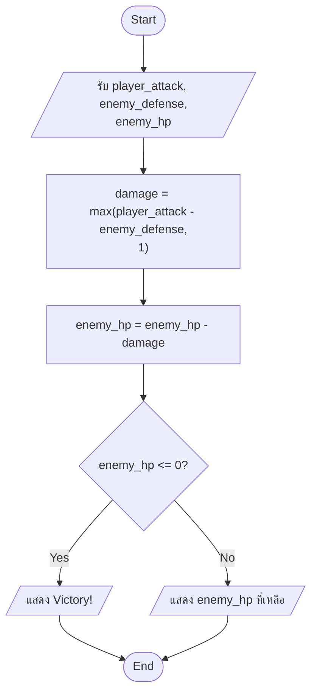
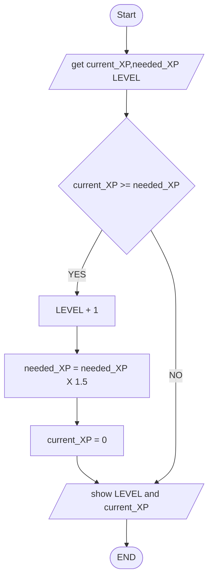

```mermaid
flowchart TD
Start([Start]) --> Input[/รับ player_attack, enemy_defense,
enemy_hp/]
Input --> Calc["damage = max(player_attack - enemy_defense,
1)"]
Calc --> Reduce["enemy_hp = enemy_hp - damage"]
Reduce --> D1{enemy_hp <= 0?}
D1 -->|Yes| Win[/แสดง Victory!/]
D1 -->|No| Show[/แสดง enemy_hp ที่เหลือ/]
Win & Show --> End([End])
```

```mermaid
flowchart TD
start([Start])-->input[/get current_XP,needed_XP LEVEL/]
input-->A{current_XP >= needed_XP}
A-->|YES| T[LEVEL + 1]
T-->B[needed_XP = needed_XP X 1.5]
B-->C[current_XP = 0]
C-->show[/show LEVEL and current_XP/]
A-->|NO| show
show-->output([END])


```
